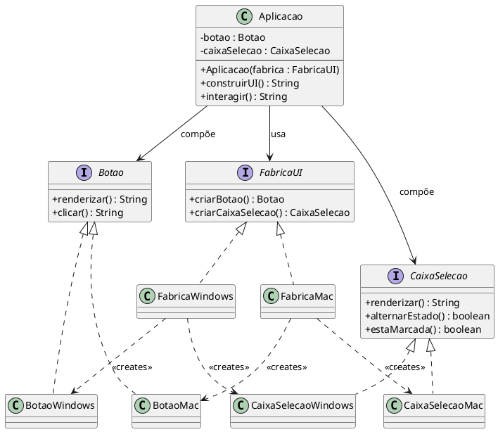

# Abstract Factory

```plantuml
@startuml AbstractFactory

skinparam classAttributeIconSize 0
skinparam monochrome false
skinparam shadowing false

interface Botao {
    + renderizar() : String
    + clicar() : String
}

interface CaixaSelecao {
    + renderizar() : String
    + alternarEstado() : boolean
    + estaMarcada() : boolean
}

class BotaoWindows implements Botao
class CaixaSelecaoWindows implements CaixaSelecao
class BotaoMac implements Botao
class CaixaSelecaoMac implements CaixaSelecao

interface FabricaUI {
    + criarBotao() : Botao
    + criarCaixaSelecao() : CaixaSelecao
}

class FabricaWindows implements FabricaUI
class FabricaMac implements FabricaUI

class Aplicacao {
    - botao : Botao
    - caixaSelecao : CaixaSelecao
    --
    + Aplicacao(fabrica : FabricaUI)
    + construirUI() : String
    + interagir() : String
}

FabricaWindows ..> BotaoWindows : <<creates>>
FabricaWindows ..> CaixaSelecaoWindows : <<creates>>
FabricaMac ..> BotaoMac : <<creates>>
FabricaMac ..> CaixaSelecaoMac : <<creates>>

Aplicacao --> FabricaUI : usa
Aplicacao --> Botao : compõe
Aplicacao --> CaixaSelecao : compõe

@enduml
```
