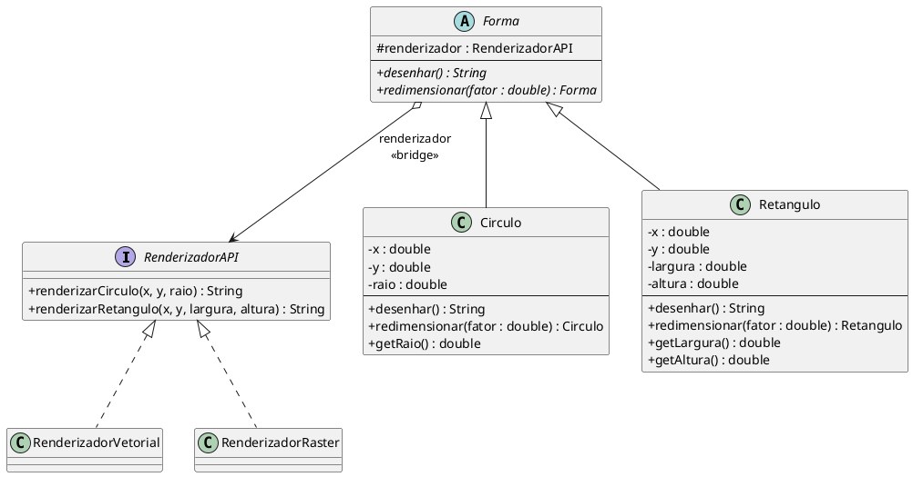

# Bridge

```plantuml
@startuml Bridge

skinparam classAttributeIconSize 0
skinparam monochrome false
skinparam shadowing false

interface RenderizadorAPI {
    + renderizarCirculo(x, y, raio) : String
    + renderizarRetangulo(x, y, largura, altura) : String
}

class RenderizadorVetorial implements RenderizadorAPI
class RenderizadorRaster implements RenderizadorAPI

abstract class Forma {
    # renderizador : RenderizadorAPI
    --
    + {abstract} desenhar() : String
    + {abstract} redimensionar(fator : double) : Forma
}

class Circulo extends Forma {
    - x : double
    - y : double
    - raio : double
    --
    + desenhar() : String
    + redimensionar(fator : double) : Circulo
    + getRaio() : double
}

class Retangulo extends Forma {
    - x : double
    - y : double
    - largura : double
    - altura : double
    --
    + desenhar() : String
    + redimensionar(fator : double) : Retangulo
    + getLargura() : double
    + getAltura() : double
}

Forma o--> RenderizadorAPI : renderizador\n<<bridge>>

@enduml
```
