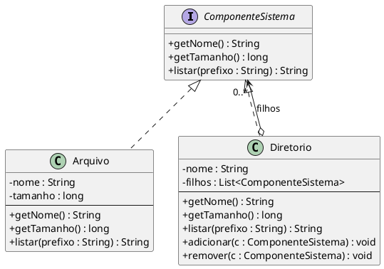

# Composite

```plantuml
@startuml Composite

skinparam classAttributeIconSize 0
skinparam monochrome false
skinparam shadowing false

interface ComponenteSistema {
    + getNome() : String
    + getTamanho() : long
    + listar(prefixo : String) : String
}

class Arquivo implements ComponenteSistema {
    - nome : String
    - tamanho : long
    --
    + getNome() : String
    + getTamanho() : long
    + listar(prefixo : String) : String
}

class Diretorio implements ComponenteSistema {
    - nome : String
    - filhos : List<ComponenteSistema>
    --
    + getNome() : String
    + getTamanho() : long
    + listar(prefixo : String) : String
    + adicionar(c : ComponenteSistema) : void
    + remover(c : ComponenteSistema) : void
}

Diretorio o--> "0..*" ComponenteSistema : filhos

@enduml
```
