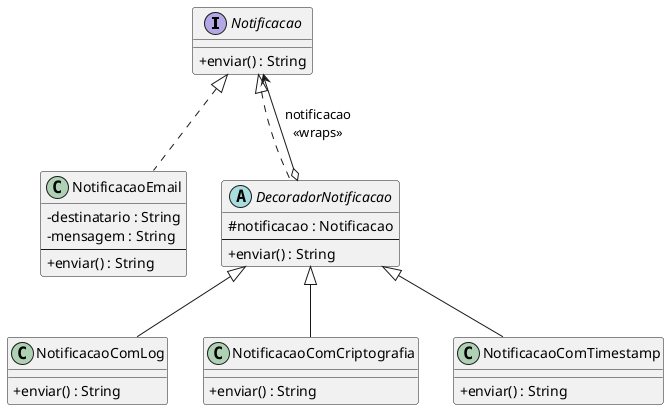

# Decorator

```plantuml
@startuml Decorator

skinparam classAttributeIconSize 0
skinparam monochrome false
skinparam shadowing false

interface Notificacao {
    + enviar() : String
}

class NotificacaoEmail {
    - destinatario : String
    - mensagem : String
    --
    + enviar() : String
}

abstract class DecoradorNotificacao {
    # notificacao : Notificacao
    --
    + enviar() : String
}

class NotificacaoComLog {
    + enviar() : String
}

class NotificacaoComCriptografia {
    + enviar() : String
}

class NotificacaoComTimestamp {
    + enviar() : String
}

Notificacao <|.. NotificacaoEmail
Notificacao <|.. DecoradorNotificacao
DecoradorNotificacao o--> Notificacao : notificacao\n<<wraps>>
DecoradorNotificacao <|-- NotificacaoComLog
DecoradorNotificacao <|-- NotificacaoComCriptografia
DecoradorNotificacao <|-- NotificacaoComTimestamp

@enduml
```
