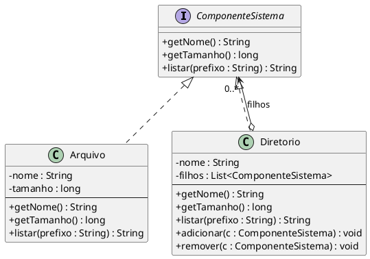
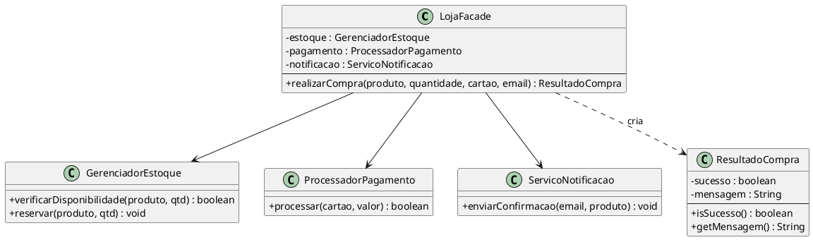

# Composite e Facade — Implementation Plan

> **For agentic workers:** REQUIRED SUB-SKILL: Use superpowers:subagent-driven-development (recommended) or superpowers:executing-plans to implement this plan task-by-task. Steps use checkbox (`- [ ]`) syntax for tracking.

**Goal:** Adicionar os padrões Composite (sistema de arquivos) e Facade (checkout de loja) ao repositório, com código, testes e diagrama seguindo as convenções existentes.

**Architecture:** Dois módulos Maven independentes (`composite`, `facade`), cada um com interface/classes no pacote `com.padroes.<padrão>`, um arquivo de testes JUnit 5 com `@Nested` por contexto, `diagram.puml` e `README.md`. TDD: testes primeiro, implementação mínima para passar.

**Tech Stack:** Java 17, Maven multi-module, JUnit Jupiter 5.10.1, PlantUML (diagrama apenas, sem dependência de runtime)

---

## Mapa de arquivos

### Composite
| Arquivo | Ação |
|---------|------|
| `pom.xml` (raiz) | Modificar — adicionar módulo `composite` |
| `composite/pom.xml` | Criar |
| `composite/src/main/java/com/padroes/composite/ComponenteSistema.java` | Criar |
| `composite/src/main/java/com/padroes/composite/Arquivo.java` | Criar |
| `composite/src/main/java/com/padroes/composite/Diretorio.java` | Criar |
| `composite/src/main/java/com/padroes/composite/Main.java` | Criar |
| `composite/src/test/java/com/padroes/composite/CompositeTest.java` | Criar |
| `composite/diagram.puml` | Criar |
| `composite/README.md` | Criar |

### Facade
| Arquivo | Ação |
|---------|------|
| `pom.xml` (raiz) | Modificar — adicionar módulo `facade` |
| `facade/pom.xml` | Criar |
| `facade/src/main/java/com/padroes/facade/GerenciadorEstoque.java` | Criar |
| `facade/src/main/java/com/padroes/facade/ProcessadorPagamento.java` | Criar |
| `facade/src/main/java/com/padroes/facade/ServicoNotificacao.java` | Criar |
| `facade/src/main/java/com/padroes/facade/ResultadoCompra.java` | Criar |
| `facade/src/main/java/com/padroes/facade/LojaFacade.java` | Criar |
| `facade/src/main/java/com/padroes/facade/Main.java` | Criar |
| `facade/src/test/java/com/padroes/facade/FacadeTest.java` | Criar |
| `facade/diagram.puml` | Criar |
| `facade/README.md` | Criar |

---

## Task 1: Setup do módulo Composite

**Files:**
- Modify: `pom.xml`
- Create: `composite/pom.xml`

- [ ] **Step 1: Adicionar módulo `composite` ao pom.xml raiz**

Em `pom.xml`, após `<module>template-method</module>`, adicionar:

```xml
        <module>composite</module>
```

- [ ] **Step 2: Criar `composite/pom.xml`**

```xml
<?xml version="1.0" encoding="UTF-8"?>
<project xmlns="http://maven.apache.org/POM/4.0.0"
         xmlns:xsi="http://www.w3.org/2001/XMLSchema-instance"
         xsi:schemaLocation="http://maven.apache.org/POM/4.0.0 http://maven.apache.org/xsd/maven-4.0.0.xsd">
    <modelVersion>4.0.0</modelVersion>

    <parent>
        <groupId>com.padroes</groupId>
        <artifactId>padroes-arquitetura</artifactId>
        <version>1.0.0</version>
    </parent>

    <artifactId>composite</artifactId>
    <name>Composite Pattern</name>

    <dependencies>
        <dependency>
            <groupId>org.junit.jupiter</groupId>
            <artifactId>junit-jupiter</artifactId>
            <scope>test</scope>
        </dependency>
    </dependencies>
</project>
```

- [ ] **Step 3: Criar estrutura de diretórios**

```bash
mkdir -p composite/src/main/java/com/padroes/composite
mkdir -p composite/src/test/java/com/padroes/composite
```

- [ ] **Step 4: Verificar que o módulo resolve sem erros**

```bash
mvn validate -pl composite
```
Expected: `BUILD SUCCESS`

---

## Task 2: Composite — Arquivo (TDD)

**Files:**
- Create: `composite/src/test/java/com/padroes/composite/CompositeTest.java`
- Create: `composite/src/main/java/com/padroes/composite/ComponenteSistema.java`
- Create: `composite/src/main/java/com/padroes/composite/Arquivo.java`

- [ ] **Step 1: Escrever os testes de `Arquivo`**

Criar `composite/src/test/java/com/padroes/composite/CompositeTest.java`:

```java
package com.padroes.composite;

import org.junit.jupiter.api.DisplayName;
import org.junit.jupiter.api.Nested;
import org.junit.jupiter.api.Test;

import static org.junit.jupiter.api.Assertions.*;

@DisplayName("Composite — Sistema de Arquivos")
class CompositeTest {

    @Nested
    @DisplayName("Arquivo")
    class ArquivoTest {

        @Test
        @DisplayName("Deve retornar o nome correto")
        void deveRetornarNome() {
            assertEquals("dados.txt", new Arquivo("dados.txt", 500).getNome());
        }

        @Test
        @DisplayName("Deve retornar o tamanho correto")
        void deveRetornarTamanho() {
            assertEquals(500L, new Arquivo("dados.txt", 500).getTamanho());
        }

        @Test
        @DisplayName("listar deve conter o nome do arquivo")
        void listarDeveConterNome() {
            assertTrue(new Arquivo("dados.txt", 500).listar("").contains("dados.txt"));
        }

        @Test
        @DisplayName("listar deve conter o tamanho")
        void listarDeveConterTamanho() {
            assertTrue(new Arquivo("dados.txt", 500).listar("").contains("500"));
        }
    }
}
```

- [ ] **Step 2: Rodar os testes — devem falhar**

```bash
mvn test -pl composite
```
Expected: FAIL — `Arquivo cannot be resolved to a type`

- [ ] **Step 3: Criar a interface `ComponenteSistema`**

Criar `composite/src/main/java/com/padroes/composite/ComponenteSistema.java`:

```java
package com.padroes.composite;

public interface ComponenteSistema {
    String getNome();
    long getTamanho();
    String listar(String prefixo);
}
```

- [ ] **Step 4: Criar `Arquivo`**

Criar `composite/src/main/java/com/padroes/composite/Arquivo.java`:

```java
package com.padroes.composite;

public class Arquivo implements ComponenteSistema {
    private final String nome;
    private final long tamanho;

    public Arquivo(String nome, long tamanho) {
        this.nome = nome;
        this.tamanho = tamanho;
    }

    @Override
    public String getNome() {
        return nome;
    }

    @Override
    public long getTamanho() {
        return tamanho;
    }

    @Override
    public String listar(String prefixo) {
        return prefixo + nome + " (" + tamanho + " bytes)";
    }
}
```

- [ ] **Step 5: Rodar os testes — devem passar**

```bash
mvn test -pl composite
```
Expected: `Tests run: 4, Failures: 0, Errors: 0`

---

## Task 3: Composite — Diretorio (TDD)

**Files:**
- Modify: `composite/src/test/java/com/padroes/composite/CompositeTest.java`
- Create: `composite/src/main/java/com/padroes/composite/Diretorio.java`

- [ ] **Step 1: Adicionar testes de `Diretorio` ao `CompositeTest.java`**

Dentro da classe `CompositeTest`, após o bloco `ArquivoTest`, adicionar:

```java
    @Nested
    @DisplayName("Diretorio")
    class DiretorioTest {

        @Test
        @DisplayName("Diretório vazio deve ter tamanho zero")
        void diretorioVazioTemTamanhoZero() {
            assertEquals(0L, new Diretorio("vazio").getTamanho());
        }

        @Test
        @DisplayName("Tamanho deve ser a soma dos filhos")
        void tamanhoDeveSerSomaFilhos() {
            Diretorio dir = new Diretorio("dir");
            dir.adicionar(new Arquivo("a.txt", 100));
            dir.adicionar(new Arquivo("b.txt", 200));
            assertEquals(300L, dir.getTamanho());
        }

        @Test
        @DisplayName("listar deve conter o nome do diretório")
        void listarDeveConterNomeDiretorio() {
            assertTrue(new Diretorio("src").listar("").contains("src"));
        }

        @Test
        @DisplayName("listar deve incluir nomes dos filhos")
        void listarDeveIncluirFilhos() {
            Diretorio dir = new Diretorio("src");
            dir.adicionar(new Arquivo("Main.java", 100));
            assertTrue(dir.listar("").contains("Main.java"));
        }

        @Test
        @DisplayName("remover deve excluir o componente")
        void removerDeveExcluirComponente() {
            Diretorio dir = new Diretorio("src");
            Arquivo arquivo = new Arquivo("temp.txt", 100);
            dir.adicionar(arquivo);
            dir.remover(arquivo);
            assertEquals(0L, dir.getTamanho());
        }
    }
```

- [ ] **Step 2: Rodar os testes — devem falhar**

```bash
mvn test -pl composite
```
Expected: FAIL — `Diretorio cannot be resolved to a type`

- [ ] **Step 3: Criar `Diretorio`**

Criar `composite/src/main/java/com/padroes/composite/Diretorio.java`:

```java
package com.padroes.composite;

import java.util.ArrayList;
import java.util.List;

public class Diretorio implements ComponenteSistema {
    private final String nome;
    private final List<ComponenteSistema> filhos = new ArrayList<>();

    public Diretorio(String nome) {
        this.nome = nome;
    }

    public void adicionar(ComponenteSistema componente) {
        filhos.add(componente);
    }

    public void remover(ComponenteSistema componente) {
        filhos.remove(componente);
    }

    @Override
    public String getNome() {
        return nome;
    }

    @Override
    public long getTamanho() {
        return filhos.stream().mapToLong(ComponenteSistema::getTamanho).sum();
    }

    @Override
    public String listar(String prefixo) {
        StringBuilder sb = new StringBuilder();
        sb.append(prefixo).append(nome).append("/");
        for (ComponenteSistema filho : filhos) {
            sb.append("\n").append(filho.listar(prefixo + "  "));
        }
        return sb.toString();
    }
}
```

- [ ] **Step 4: Rodar os testes — devem passar**

```bash
mvn test -pl composite
```
Expected: `Tests run: 9, Failures: 0, Errors: 0`

---

## Task 4: Composite — Comportamento, Main, diagrama e commit

**Files:**
- Modify: `composite/src/test/java/com/padroes/composite/CompositeTest.java`
- Create: `composite/src/main/java/com/padroes/composite/Main.java`
- Create: `composite/diagram.puml`
- Create: `composite/README.md`

- [ ] **Step 1: Adicionar testes de comportamento composite ao `CompositeTest.java`**

Dentro de `CompositeTest`, após `DiretorioTest`, adicionar:

```java
    @Nested
    @DisplayName("Comportamento Composite")
    class ComportamentoCompositeTest {

        @Test
        @DisplayName("Deve tratar Arquivo e Diretorio pela mesma interface")
        void deveTratarUniformemente() {
            ComponenteSistema arquivo = new Arquivo("a.txt", 100);
            Diretorio dir = new Diretorio("dir");
            dir.adicionar(arquivo);
            Diretorio raiz = new Diretorio("raiz");
            raiz.adicionar(dir);
            assertDoesNotThrow(() -> raiz.listar(""));
        }

        @Test
        @DisplayName("Tamanho deve ser calculado recursivamente em profundidade arbitrária")
        void tamanhoRecursivoEmProfundidadeArbitraria() {
            Diretorio nivel3 = new Diretorio("nivel3");
            nivel3.adicionar(new Arquivo("deep.txt", 50));

            Diretorio nivel2 = new Diretorio("nivel2");
            nivel2.adicionar(nivel3);

            Diretorio nivel1 = new Diretorio("nivel1");
            nivel1.adicionar(nivel2);
            nivel1.adicionar(new Arquivo("raso.txt", 150));

            assertEquals(200L, nivel1.getTamanho());
        }

        @Test
        @DisplayName("listar deve indentar filhos por nível")
        void listarDeveIndentarPorNivel() {
            Diretorio pai = new Diretorio("pai");
            pai.adicionar(new Arquivo("filho.txt", 10));
            String listagem = pai.listar("");
            assertTrue(listagem.contains("pai"));
            assertTrue(listagem.contains("filho.txt"));
            int indicePai = listagem.indexOf("pai");
            int indiceFilho = listagem.indexOf("filho.txt");
            assertTrue(indiceFilho > indicePai);
        }
    }
```

- [ ] **Step 2: Rodar os testes — devem passar sem novas classes**

```bash
mvn test -pl composite
```
Expected: `Tests run: 12, Failures: 0, Errors: 0`

- [ ] **Step 3: Criar `Main.java`**

Criar `composite/src/main/java/com/padroes/composite/Main.java`:

```java
package com.padroes.composite;

public class Main {
    public static void main(String[] args) {
        Arquivo readme = new Arquivo("README.md", 1024);
        Arquivo app = new Arquivo("App.java", 2048);
        Arquivo appTest = new Arquivo("AppTest.java", 512);

        Diretorio src = new Diretorio("src");
        src.adicionar(app);
        src.adicionar(appTest);

        Diretorio projeto = new Diretorio("projeto");
        projeto.adicionar(readme);
        projeto.adicionar(src);

        System.out.println(projeto.listar(""));
        System.out.println("Tamanho total: " + projeto.getTamanho() + " bytes");
    }
}
```

- [ ] **Step 4: Criar `composite/diagram.puml`**

```
@startuml Composite

skinparam classAttributeIconSize 0
skinparam monochrome false
skinparam shadowing false

title Padrão Composite — Sistema de Arquivos

' ── Component ──
interface ComponenteSistema {
    + getNome() : String
    + getTamanho() : long
    + listar(prefixo : String) : String
}

' ── Leaf ──
class Arquivo implements ComponenteSistema {
    - nome : String
    - tamanho : long
    --
    + getNome() : String
    + getTamanho() : long
    + listar(prefixo : String) : String
}

' ── Composite ──
class Diretorio implements ComponenteSistema {
    - nome : String
    - filhos : List<ComponenteSistema>
    --
    + getNome() : String
    + getTamanho() : long
    + listar(prefixo : String) : String
    + adicionar(c : ComponenteSistema) : void
    + remover(c : ComponenteSistema) : void
}

Diretorio o--> "0..*" ComponenteSistema : filhos

note bottom of Diretorio
  getTamanho() soma recursivamente
  todos os filhos da árvore.
  adicionar/remover não estão na
  interface — evita métodos inválidos
  em Arquivo.
end note

note bottom of Arquivo
  Folha (Leaf): sem filhos.
  getTamanho() retorna valor fixo.
end note

@enduml
```

- [ ] **Step 5: Criar `composite/README.md`**

```markdown
# Composite


```

- [ ] **Step 6: Rodar todos os testes do módulo e commitar**

```bash
mvn test -pl composite
```
Expected: `Tests run: 12, Failures: 0, Errors: 0`

```bash
git add composite/ pom.xml
git commit -m "feat(composite): exemplo do padrão Composite"
```

---

## Task 5: Setup do módulo Facade

**Files:**
- Modify: `pom.xml`
- Create: `facade/pom.xml`

- [ ] **Step 1: Adicionar módulo `facade` ao pom.xml raiz**

Em `pom.xml`, após `<module>composite</module>`, adicionar:

```xml
        <module>facade</module>
```

- [ ] **Step 2: Criar `facade/pom.xml`**

```xml
<?xml version="1.0" encoding="UTF-8"?>
<project xmlns="http://maven.apache.org/POM/4.0.0"
         xmlns:xsi="http://www.w3.org/2001/XMLSchema-instance"
         xsi:schemaLocation="http://maven.apache.org/POM/4.0.0 http://maven.apache.org/xsd/maven-4.0.0.xsd">
    <modelVersion>4.0.0</modelVersion>

    <parent>
        <groupId>com.padroes</groupId>
        <artifactId>padroes-arquitetura</artifactId>
        <version>1.0.0</version>
    </parent>

    <artifactId>facade</artifactId>
    <name>Facade Pattern</name>

    <dependencies>
        <dependency>
            <groupId>org.junit.jupiter</groupId>
            <artifactId>junit-jupiter</artifactId>
            <scope>test</scope>
        </dependency>
    </dependencies>
</project>
```

- [ ] **Step 3: Criar estrutura de diretórios**

```bash
mkdir -p facade/src/main/java/com/padroes/facade
mkdir -p facade/src/test/java/com/padroes/facade
```

- [ ] **Step 4: Verificar que o módulo resolve**

```bash
mvn validate -pl facade
```
Expected: `BUILD SUCCESS`

---

## Task 6: Facade — Subsistemas e ResultadoCompra (TDD)

**Files:**
- Create: `facade/src/test/java/com/padroes/facade/FacadeTest.java`
- Create: `facade/src/main/java/com/padroes/facade/ResultadoCompra.java`
- Create: `facade/src/main/java/com/padroes/facade/GerenciadorEstoque.java`
- Create: `facade/src/main/java/com/padroes/facade/ProcessadorPagamento.java`
- Create: `facade/src/main/java/com/padroes/facade/ServicoNotificacao.java`

- [ ] **Step 1: Criar `FacadeTest.java` com testes de subsistemas**

Criar `facade/src/test/java/com/padroes/facade/FacadeTest.java`:

```java
package com.padroes.facade;

import org.junit.jupiter.api.BeforeEach;
import org.junit.jupiter.api.DisplayName;
import org.junit.jupiter.api.Nested;
import org.junit.jupiter.api.Test;

import static org.junit.jupiter.api.Assertions.*;

@DisplayName("Facade — Checkout de Loja")
class FacadeTest {

    private GerenciadorEstoque estoque;
    private ProcessadorPagamento pagamento;
    private ServicoNotificacao notificacao;
    private LojaFacade loja;

    @BeforeEach
    void setUp() {
        estoque = new GerenciadorEstoque();
        pagamento = new ProcessadorPagamento();
        notificacao = new ServicoNotificacao();
        loja = new LojaFacade(estoque, pagamento, notificacao);
    }

    @Nested
    @DisplayName("Compra com sucesso")
    class CompraComSucessoTest {

        @Test
        @DisplayName("Deve retornar sucesso quando estoque e pagamento são válidos")
        void deveRetornarSucesso() {
            ResultadoCompra resultado = loja.realizarCompra("Notebook", 1, "4111-1111-1111-1111", "a@b.com");
            assertTrue(resultado.isSucesso());
        }

        @Test
        @DisplayName("Mensagem deve conter o nome do produto")
        void mensagemDeveConterProduto() {
            ResultadoCompra resultado = loja.realizarCompra("Notebook", 1, "4111-1111-1111-1111", "a@b.com");
            assertTrue(resultado.getMensagem().contains("Notebook"));
        }

        @Test
        @DisplayName("Deve enviar notificação após compra bem-sucedida")
        void deveEnviarNotificacao() {
            loja.realizarCompra("Mouse", 1, "4111-1111-1111-1111", "cliente@email.com");
            assertNotNull(notificacao.getUltimaNotificacao());
            assertTrue(notificacao.getUltimaNotificacao().contains("cliente@email.com"));
        }

        @Test
        @DisplayName("Deve reduzir o estoque após compra bem-sucedida")
        void deveReduzirEstoque() {
            loja.realizarCompra("Mouse", 1, "4111-1111-1111-1111", "a@b.com");
            assertFalse(estoque.verificarDisponibilidade("Mouse", 50));
        }
    }

    @Nested
    @DisplayName("Estoque insuficiente")
    class EstoqueInsuficienteTest {

        @Test
        @DisplayName("Deve retornar falha quando produto não existe no estoque")
        void deveRetornarFalhaProdutoInexistente() {
            ResultadoCompra resultado = loja.realizarCompra("Monitor", 1, "4111-1111-1111-1111", "a@b.com");
            assertFalse(resultado.isSucesso());
        }

        @Test
        @DisplayName("Não deve enviar notificação quando estoque é insuficiente")
        void naoDeveEnviarNotificacaoSemEstoque() {
            loja.realizarCompra("Monitor", 1, "4111-1111-1111-1111", "a@b.com");
            assertNull(notificacao.getUltimaNotificacao());
        }

        @Test
        @DisplayName("Mensagem deve indicar problema com estoque")
        void mensagemDeveIndicarEstoque() {
            ResultadoCompra resultado = loja.realizarCompra("Monitor", 1, "4111-1111-1111-1111", "a@b.com");
            assertTrue(resultado.getMensagem().toLowerCase().contains("estoque")
                || resultado.getMensagem().contains("Monitor"));
        }
    }

    @Nested
    @DisplayName("Pagamento recusado")
    class PagamentoRecusadoTest {

        @Test
        @DisplayName("Deve retornar falha com cartão inválido")
        void deveRetornarFalhaCartaoInvalido() {
            ResultadoCompra resultado = loja.realizarCompra("Notebook", 1, "", "a@b.com");
            assertFalse(resultado.isSucesso());
        }

        @Test
        @DisplayName("Não deve reservar estoque quando pagamento é recusado")
        void naoDeveReservarEstoque() {
            loja.realizarCompra("Notebook", 1, "", "a@b.com");
            assertTrue(estoque.verificarDisponibilidade("Notebook", 10));
        }

        @Test
        @DisplayName("Não deve enviar notificação quando pagamento é recusado")
        void naoDeveEnviarNotificacao() {
            loja.realizarCompra("Notebook", 1, "", "a@b.com");
            assertNull(notificacao.getUltimaNotificacao());
        }
    }

    @Nested
    @DisplayName("Facade")
    class FacadeComportamentoTest {

        @Test
        @DisplayName("Deve simplificar a interface em um único método")
        void devePossuirInterfaceSimplificada() {
            assertDoesNotThrow(() -> loja.realizarCompra("Mouse", 1, "cartao-valido", "user@email.com"));
        }

        @Test
        @DisplayName("Subsistemas podem ser trocados sem alterar o cliente")
        void subsistemasPodemsSerTrocados() {
            LojaFacade outraLoja = new LojaFacade(
                new GerenciadorEstoque(),
                new ProcessadorPagamento(),
                new ServicoNotificacao()
            );
            ResultadoCompra resultado = outraLoja.realizarCompra("Teclado", 1, "4111-1111-1111-1111", "a@b.com");
            assertTrue(resultado.isSucesso());
        }
    }
}
```

- [ ] **Step 2: Rodar os testes — devem falhar**

```bash
mvn test -pl facade
```
Expected: FAIL — `GerenciadorEstoque cannot be resolved to a type`

- [ ] **Step 3: Criar `ResultadoCompra`**

Criar `facade/src/main/java/com/padroes/facade/ResultadoCompra.java`:

```java
package com.padroes.facade;

public class ResultadoCompra {
    private final boolean sucesso;
    private final String mensagem;

    public ResultadoCompra(boolean sucesso, String mensagem) {
        this.sucesso = sucesso;
        this.mensagem = mensagem;
    }

    public boolean isSucesso() {
        return sucesso;
    }

    public String getMensagem() {
        return mensagem;
    }
}
```

- [ ] **Step 4: Criar `GerenciadorEstoque`**

Criar `facade/src/main/java/com/padroes/facade/GerenciadorEstoque.java`:

```java
package com.padroes.facade;

import java.util.HashMap;
import java.util.Map;

public class GerenciadorEstoque {
    private final Map<String, Integer> estoque = new HashMap<>();

    public GerenciadorEstoque() {
        estoque.put("Notebook", 10);
        estoque.put("Mouse", 50);
        estoque.put("Teclado", 30);
    }

    public boolean verificarDisponibilidade(String produto, int quantidade) {
        return estoque.getOrDefault(produto, 0) >= quantidade;
    }

    public void reservar(String produto, int quantidade) {
        estoque.merge(produto, -quantidade, Integer::sum);
    }
}
```

- [ ] **Step 5: Criar `ProcessadorPagamento`**

Criar `facade/src/main/java/com/padroes/facade/ProcessadorPagamento.java`:

```java
package com.padroes.facade;

public class ProcessadorPagamento {
    public boolean processar(String cartao, double valor) {
        return cartao != null && !cartao.isBlank() && valor > 0;
    }
}
```

- [ ] **Step 6: Criar `ServicoNotificacao`**

Criar `facade/src/main/java/com/padroes/facade/ServicoNotificacao.java`:

```java
package com.padroes.facade;

public class ServicoNotificacao {
    private String ultimaNotificacao;

    public void enviarConfirmacao(String email, String produto) {
        ultimaNotificacao = "Confirmação enviada para " + email + ": " + produto;
    }

    public String getUltimaNotificacao() {
        return ultimaNotificacao;
    }
}
```

- [ ] **Step 7: Rodar os testes — ainda devem falhar (LojaFacade não existe)**

```bash
mvn test -pl facade
```
Expected: FAIL — `LojaFacade cannot be resolved to a type`

---

## Task 7: Facade — LojaFacade, Main, diagrama e commit

**Files:**
- Create: `facade/src/main/java/com/padroes/facade/LojaFacade.java`
- Create: `facade/src/main/java/com/padroes/facade/Main.java`
- Create: `facade/diagram.puml`
- Create: `facade/README.md`

- [ ] **Step 1: Criar `LojaFacade`**

Criar `facade/src/main/java/com/padroes/facade/LojaFacade.java`:

```java
package com.padroes.facade;

public class LojaFacade {
    private final GerenciadorEstoque estoque;
    private final ProcessadorPagamento pagamento;
    private final ServicoNotificacao notificacao;

    public LojaFacade(GerenciadorEstoque estoque, ProcessadorPagamento pagamento, ServicoNotificacao notificacao) {
        this.estoque = estoque;
        this.pagamento = pagamento;
        this.notificacao = notificacao;
    }

    public ResultadoCompra realizarCompra(String produto, int quantidade, String cartao, String email) {
        if (!estoque.verificarDisponibilidade(produto, quantidade)) {
            return new ResultadoCompra(false, "Estoque insuficiente para: " + produto);
        }
        if (!pagamento.processar(cartao, quantidade)) {
            return new ResultadoCompra(false, "Pagamento recusado para o cartão: " + cartao);
        }
        estoque.reservar(produto, quantidade);
        notificacao.enviarConfirmacao(email, produto);
        return new ResultadoCompra(true, "Compra realizada com sucesso: " + produto);
    }
}
```

- [ ] **Step 2: Rodar os testes — devem passar**

```bash
mvn test -pl facade
```
Expected: `Tests run: 11, Failures: 0, Errors: 0`

- [ ] **Step 3: Criar `Main.java`**

Criar `facade/src/main/java/com/padroes/facade/Main.java`:

```java
package com.padroes.facade;

public class Main {
    public static void main(String[] args) {
        LojaFacade loja = new LojaFacade(
            new GerenciadorEstoque(),
            new ProcessadorPagamento(),
            new ServicoNotificacao()
        );

        ResultadoCompra compra = loja.realizarCompra("Notebook", 1, "4111-1111-1111-1111", "cliente@email.com");
        System.out.println(compra.getMensagem());

        ResultadoCompra semEstoque = loja.realizarCompra("Monitor", 1, "4111-1111-1111-1111", "cliente@email.com");
        System.out.println(semEstoque.getMensagem());

        ResultadoCompra pagamentoRecusado = loja.realizarCompra("Mouse", 1, "", "cliente@email.com");
        System.out.println(pagamentoRecusado.getMensagem());
    }
}
```

- [ ] **Step 4: Criar `facade/diagram.puml`**

```
@startuml Facade

skinparam classAttributeIconSize 0
skinparam monochrome false
skinparam shadowing false

title Padrão Facade — Checkout de Loja

' ── Cliente ──
class Cliente <<externo>> {
    + realizarCompra(...)
}

' ── Facade ──
class LojaFacade {
    - estoque : GerenciadorEstoque
    - pagamento : ProcessadorPagamento
    - notificacao : ServicoNotificacao
    --
    + realizarCompra(produto, quantidade, cartao, email) : ResultadoCompra
}

' ── Subsistemas ──
class GerenciadorEstoque {
    - estoque : Map<String, Integer>
    --
    + verificarDisponibilidade(produto, qtd) : boolean
    + reservar(produto, qtd) : void
}

class ProcessadorPagamento {
    + processar(cartao, valor) : boolean
}

class ServicoNotificacao {
    - ultimaNotificacao : String
    --
    + enviarConfirmacao(email, produto) : void
    + getUltimaNotificacao() : String
}

' ── Value Object ──
class ResultadoCompra {
    - sucesso : boolean
    - mensagem : String
    --
    + isSucesso() : boolean
    + getMensagem() : String
}

Cliente --> LojaFacade : usa
LojaFacade --> GerenciadorEstoque
LojaFacade --> ProcessadorPagamento
LojaFacade --> ServicoNotificacao
LojaFacade ..> ResultadoCompra : cria

note right of LojaFacade
  A Facade esconde a complexidade dos
  três subsistemas, expondo apenas
  realizarCompra() ao cliente.
  O cliente não conhece os subsistemas.
end note

@enduml
```

- [ ] **Step 5: Criar `facade/README.md`**

```markdown
# Facade


```

- [ ] **Step 6: Rodar todos os testes do módulo e commitar**

```bash
mvn test -pl facade
```
Expected: `Tests run: 11, Failures: 0, Errors: 0`

```bash
git add facade/ pom.xml
git commit -m "feat(facade): exemplo do padrão Facade"
```

---

## Task 8: Verificação final

- [ ] **Step 1: Rodar todos os testes do repositório**

```bash
mvn test
```
Expected: todos os módulos passam, nenhuma regressão.

- [ ] **Step 2: Verificar que os dois novos módulos aparecem no build**

Output deve incluir:
```
[INFO] --- maven-surefire-plugin:...:test (default-test) @ composite ---
[INFO] --- maven-surefire-plugin:...:test (default-test) @ facade ---
```
