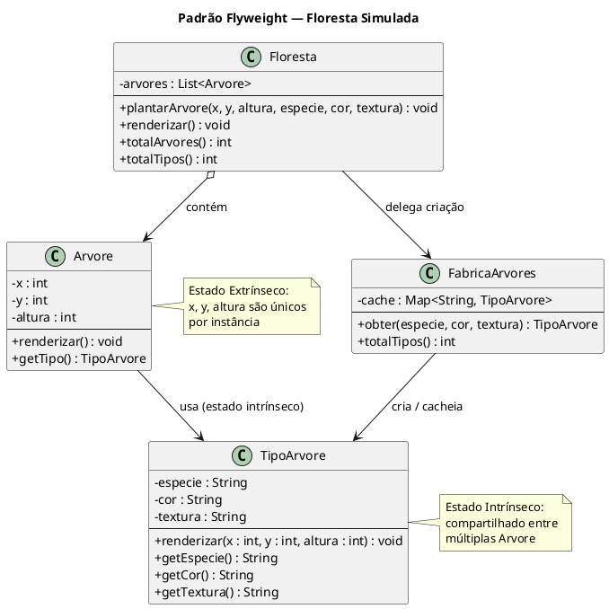
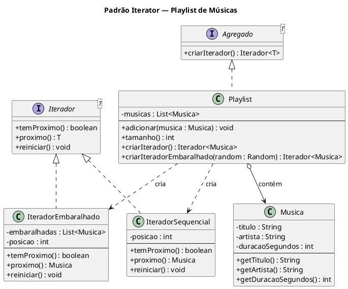
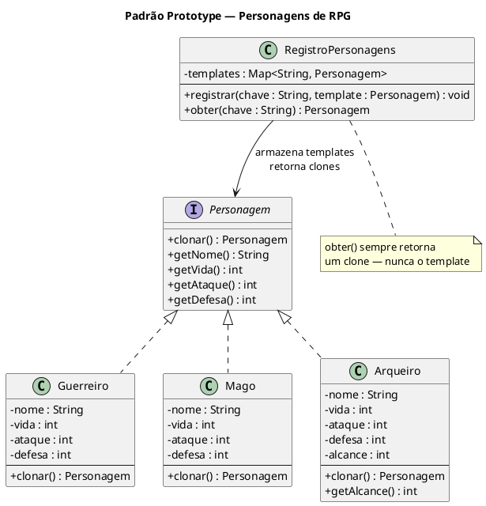

# Flyweight, Iterator e Prototype — Implementation Plan

> **For agentic workers:** REQUIRED SUB-SKILL: Use superpowers:subagent-driven-development (recommended) or superpowers:executing-plans to implement this plan task-by-task. Steps use checkbox (`- [ ]`) syntax for tracking.

**Goal:** Adicionar três módulos Maven ao projeto multi-módulo — Flyweight (Floresta Simulada), Iterator (Playlist de Músicas) e Prototype (Personagens de RPG) — seguindo as convenções existentes.

**Architecture:** Cada padrão vive em seu próprio módulo Maven (`flyweight/`, `iterator/`, `prototype/`) com pacote `com.padroes.<padrão>`, classes em português, `Main.java` de demo, testes JUnit 5 com `@Nested`/`@DisplayName` e diagrama `diagram.puml`. O `pom.xml` raiz é atualizado para registrar cada novo módulo.

**Tech Stack:** Java 17, Maven 3, JUnit Jupiter 5.10.1

---

## Mapa de Arquivos

### Flyweight
| Arquivo | Responsabilidade |
|---|---|
| `flyweight/pom.xml` | Módulo Maven com parent e dependência JUnit |
| `flyweight/src/main/java/com/padroes/flyweight/TipoArvore.java` | Flyweight concreto — estado intrínseco |
| `flyweight/src/main/java/com/padroes/flyweight/FabricaArvores.java` | Factory + cache de flyweights |
| `flyweight/src/main/java/com/padroes/flyweight/Arvore.java` | Contexto — estado extrínseco + referência ao flyweight |
| `flyweight/src/main/java/com/padroes/flyweight/Floresta.java` | Cliente — compõe árvores usando a fábrica |
| `flyweight/src/main/java/com/padroes/flyweight/Main.java` | Demo executável |
| `flyweight/src/test/java/com/padroes/flyweight/FlyweightTest.java` | Testes JUnit 5 |
| `flyweight/diagram.puml` | Diagrama PlantUML |

### Iterator
| Arquivo | Responsabilidade |
|---|---|
| `iterator/pom.xml` | Módulo Maven |
| `iterator/src/main/java/com/padroes/iterator/Iterador.java` | Interface genérica do iterador |
| `iterator/src/main/java/com/padroes/iterator/Agregado.java` | Interface da coleção iterável |
| `iterator/src/main/java/com/padroes/iterator/Musica.java` | Elemento da coleção |
| `iterator/src/main/java/com/padroes/iterator/Playlist.java` | Coleção concreta — implementa `Agregado<Musica>` |
| `iterator/src/main/java/com/padroes/iterator/IteradorSequencial.java` | Iteração em ordem de inserção |
| `iterator/src/main/java/com/padroes/iterator/IteradorEmbaralhado.java` | Iteração aleatória com `Random` injetável |
| `iterator/src/main/java/com/padroes/iterator/Main.java` | Demo executável |
| `iterator/src/test/java/com/padroes/iterator/IteratorTest.java` | Testes JUnit 5 |
| `iterator/diagram.puml` | Diagrama PlantUML |

### Prototype
| Arquivo | Responsabilidade |
|---|---|
| `prototype/pom.xml` | Módulo Maven |
| `prototype/src/main/java/com/padroes/prototype/Personagem.java` | Interface Prototype com `clonar()` |
| `prototype/src/main/java/com/padroes/prototype/Guerreiro.java` | Prototype concreto |
| `prototype/src/main/java/com/padroes/prototype/Mago.java` | Prototype concreto |
| `prototype/src/main/java/com/padroes/prototype/Arqueiro.java` | Prototype concreto com campo extra `alcance` |
| `prototype/src/main/java/com/padroes/prototype/RegistroPersonagens.java` | Registry — armazena templates, retorna clones |
| `prototype/src/main/java/com/padroes/prototype/Main.java` | Demo executável |
| `prototype/src/test/java/com/padroes/prototype/PrototypeTest.java` | Testes JUnit 5 |
| `prototype/diagram.puml` | Diagrama PlantUML |

---

## Task 1: Flyweight — Floresta Simulada

**Files:**
- Create: `flyweight/pom.xml`
- Create: `flyweight/src/main/java/com/padroes/flyweight/TipoArvore.java`
- Create: `flyweight/src/main/java/com/padroes/flyweight/FabricaArvores.java`
- Create: `flyweight/src/main/java/com/padroes/flyweight/Arvore.java`
- Create: `flyweight/src/main/java/com/padroes/flyweight/Floresta.java`
- Create: `flyweight/src/main/java/com/padroes/flyweight/Main.java`
- Create: `flyweight/src/test/java/com/padroes/flyweight/FlyweightTest.java`
- Create: `flyweight/diagram.puml`
- Modify: `pom.xml` (adicionar módulo `flyweight`)

- [ ] **Step 1: Registrar módulo no pom.xml raiz**

Em `pom.xml`, adicionar `<module>flyweight</module>` na lista de módulos (após `<module>visitor</module>`):

```xml
<module>visitor</module>
<module>flyweight</module>
```

- [ ] **Step 2: Criar estrutura de diretórios e pom.xml do módulo**

```bash
mkdir -p flyweight/src/main/java/com/padroes/flyweight
mkdir -p flyweight/src/test/java/com/padroes/flyweight
```

Criar `flyweight/pom.xml`:

```xml
<?xml version="1.0" encoding="UTF-8"?>
<project xmlns="http://maven.apache.org/POM/4.0.0"
         xmlns:xsi="http://www.w3.org/2001/XMLSchema-instance"
         xsi:schemaLocation="http://maven.apache.org/POM/4.0.0 http://maven.apache.org/xsd/maven-4.0.0.xsd">
    <modelVersion>4.0.0</modelVersion>

    <parent>
        <groupId>com.padroes</groupId>
        <artifactId>padroes-arquitetura</artifactId>
        <version>1.0.0</version>
    </parent>

    <artifactId>flyweight</artifactId>
    <name>Flyweight Pattern</name>

    <dependencies>
        <dependency>
            <groupId>org.junit.jupiter</groupId>
            <artifactId>junit-jupiter</artifactId>
            <scope>test</scope>
        </dependency>
    </dependencies>
</project>
```

- [ ] **Step 3: Criar stubs das classes de produção**

`flyweight/src/main/java/com/padroes/flyweight/TipoArvore.java`:
```java
package com.padroes.flyweight;

public class TipoArvore {
    private final String especie;
    private final String cor;
    private final String textura;

    public TipoArvore(String especie, String cor, String textura) {
        this.especie = especie;
        this.cor = cor;
        this.textura = textura;
    }

    public void renderizar(int x, int y, int altura) {
        System.out.printf("Árvore[%s] cor=%s textura=%s em (%d,%d) altura=%d%n",
                especie, cor, textura, x, y, altura);
    }

    public String getEspecie() { return especie; }
    public String getCor() { return cor; }
    public String getTextura() { return textura; }
}
```

`flyweight/src/main/java/com/padroes/flyweight/FabricaArvores.java`:
```java
package com.padroes.flyweight;

import java.util.HashMap;
import java.util.Map;

public class FabricaArvores {
    private final Map<String, TipoArvore> cache = new HashMap<>();

    public TipoArvore obter(String especie, String cor, String textura) {
        return null; // stub
    }

    public int totalTipos() {
        return 0; // stub
    }
}
```

`flyweight/src/main/java/com/padroes/flyweight/Arvore.java`:
```java
package com.padroes.flyweight;

public class Arvore {
    private final int x;
    private final int y;
    private final int altura;
    private final TipoArvore tipo;

    public Arvore(int x, int y, int altura, TipoArvore tipo) {
        this.x = x;
        this.y = y;
        this.altura = altura;
        this.tipo = tipo;
    }

    public void renderizar() {
        tipo.renderizar(x, y, altura);
    }

    public TipoArvore getTipo() { return tipo; }
    public int getX() { return x; }
    public int getY() { return y; }
    public int getAltura() { return altura; }
}
```

`flyweight/src/main/java/com/padroes/flyweight/Floresta.java`:
```java
package com.padroes.flyweight;

import java.util.ArrayList;
import java.util.List;

public class Floresta {
    private final List<Arvore> arvores = new ArrayList<>();
    private final FabricaArvores fabrica = new FabricaArvores();

    public void plantarArvore(int x, int y, int altura, String especie, String cor, String textura) {
        // stub
    }

    public void renderizar() {
        arvores.forEach(Arvore::renderizar);
    }

    public int totalArvores() { return arvores.size(); }
    public int totalTipos() { return fabrica.totalTipos(); }
}
```

- [ ] **Step 4: Escrever o teste**

`flyweight/src/test/java/com/padroes/flyweight/FlyweightTest.java`:
```java
package com.padroes.flyweight;

import org.junit.jupiter.api.BeforeEach;
import org.junit.jupiter.api.DisplayName;
import org.junit.jupiter.api.Nested;
import org.junit.jupiter.api.Test;

import static org.junit.jupiter.api.Assertions.*;

@DisplayName("Flyweight — Floresta Simulada")
class FlyweightTest {

    private Floresta floresta;

    @BeforeEach
    void setUp() {
        floresta = new Floresta();
    }

    @Nested
    @DisplayName("FabricaArvores — compartilhamento de flyweights")
    class FabricaArvoresTest {

        private FabricaArvores fabrica;

        @BeforeEach
        void setUp() { fabrica = new FabricaArvores(); }

        @Test
        @DisplayName("Mesma combinação retorna o mesmo objeto TipoArvore")
        void mesmaCombinacaoRetornaMesmoObjeto() {
            TipoArvore a = fabrica.obter("Carvalho", "Verde", "Rugosa");
            TipoArvore b = fabrica.obter("Carvalho", "Verde", "Rugosa");
            assertSame(a, b);
        }

        @Test
        @DisplayName("Combinações distintas criam objetos diferentes")
        void combinacoesDistintasCriaObjetos() {
            TipoArvore a = fabrica.obter("Carvalho", "Verde", "Rugosa");
            TipoArvore b = fabrica.obter("Pinheiro", "Verde-escuro", "Lisa");
            assertNotSame(a, b);
            assertEquals(2, fabrica.totalTipos());
        }

        @Test
        @DisplayName("100 chamadas com mesmos parâmetros criam apenas 1 TipoArvore")
        void cemChamadasCriam1Tipo() {
            for (int i = 0; i < 100; i++) {
                fabrica.obter("Bambu", "Amarelo", "Estriada");
            }
            assertEquals(1, fabrica.totalTipos());
        }
    }

    @Nested
    @DisplayName("Floresta — estado extrínseco por instância")
    class FlorestaTest {

        @Test
        @DisplayName("Plantar 1000 árvores do mesmo tipo usa apenas 1 flyweight")
        void milArvoresMesmoTipoUsa1Flyweight() {
            for (int i = 0; i < 1000; i++) {
                floresta.plantarArvore(i, i * 2, 10, "Carvalho", "Verde", "Rugosa");
            }
            assertEquals(1000, floresta.totalArvores());
            assertEquals(1, floresta.totalTipos());
        }

        @Test
        @DisplayName("3 tipos distintos criam 3 flyweights")
        void tresTiposDistintoCria3Flyweights() {
            floresta.plantarArvore(0, 0, 10, "Carvalho", "Verde", "Rugosa");
            floresta.plantarArvore(1, 1, 8, "Pinheiro", "Verde-escuro", "Lisa");
            floresta.plantarArvore(2, 2, 15, "Bambu", "Amarelo", "Estriada");
            assertEquals(3, floresta.totalTipos());
        }

        @Test
        @DisplayName("renderizar() não lança exceção")
        void renderizarNaoLancaExcecao() {
            floresta.plantarArvore(0, 0, 10, "Carvalho", "Verde", "Rugosa");
            floresta.plantarArvore(5, 5, 12, "Pinheiro", "Verde-escuro", "Lisa");
            assertDoesNotThrow(() -> floresta.renderizar());
        }

        @Test
        @DisplayName("Estado extrínseco difere entre árvores do mesmo tipo")
        void estadoExtrinsecoDifereEntreArvores() {
            floresta.plantarArvore(10, 20, 5, "Carvalho", "Verde", "Rugosa");
            floresta.plantarArvore(30, 40, 15, "Carvalho", "Verde", "Rugosa");
            assertEquals(2, floresta.totalArvores());
            assertEquals(1, floresta.totalTipos());
        }
    }
}
```

- [ ] **Step 5: Rodar testes e confirmar falhas**

```bash
mvn test -pl flyweight
```

Esperado: falhas em `mesmaCombinacaoRetornaMesmoObjeto`, `milArvoresMesmoTipoUsa1Flyweight` e outros (stubs retornam null/0).

- [ ] **Step 6: Implementar FabricaArvores e Floresta**

`flyweight/src/main/java/com/padroes/flyweight/FabricaArvores.java` (implementação completa):
```java
package com.padroes.flyweight;

import java.util.HashMap;
import java.util.Map;

public class FabricaArvores {
    private final Map<String, TipoArvore> cache = new HashMap<>();

    public TipoArvore obter(String especie, String cor, String textura) {
        String chave = especie + "#" + cor + "#" + textura;
        return cache.computeIfAbsent(chave, k -> new TipoArvore(especie, cor, textura));
    }

    public int totalTipos() {
        return cache.size();
    }
}
```

`flyweight/src/main/java/com/padroes/flyweight/Floresta.java` (implementação completa):
```java
package com.padroes.flyweight;

import java.util.ArrayList;
import java.util.List;

public class Floresta {
    private final List<Arvore> arvores = new ArrayList<>();
    private final FabricaArvores fabrica = new FabricaArvores();

    public void plantarArvore(int x, int y, int altura, String especie, String cor, String textura) {
        TipoArvore tipo = fabrica.obter(especie, cor, textura);
        arvores.add(new Arvore(x, y, altura, tipo));
    }

    public void renderizar() {
        arvores.forEach(Arvore::renderizar);
    }

    public int totalArvores() { return arvores.size(); }
    public int totalTipos() { return fabrica.totalTipos(); }
}
```

- [ ] **Step 7: Rodar testes e confirmar que passam**

```bash
mvn test -pl flyweight
```

Esperado: `BUILD SUCCESS`, todos os 7 testes verdes.

- [ ] **Step 8: Criar Main.java**

`flyweight/src/main/java/com/padroes/flyweight/Main.java`:
```java
package com.padroes.flyweight;

public class Main {
    public static void main(String[] args) {
        Floresta floresta = new Floresta();

        for (int i = 0; i < 500; i++)
            floresta.plantarArvore(i * 2, i * 3, 10 + (i % 5), "Carvalho", "Verde", "Rugosa");
        for (int i = 0; i < 300; i++)
            floresta.plantarArvore(i, i * 2, 8 + (i % 3), "Pinheiro", "Verde-escuro", "Lisa");
        for (int i = 0; i < 200; i++)
            floresta.plantarArvore(i * 4, i, 15 + (i % 7), "Bambu", "Amarelo", "Estriada");

        System.out.printf("Árvores plantadas : %d%n", floresta.totalArvores());
        System.out.printf("Tipos de árvore   : %d (economia de %d objetos)%n",
                floresta.totalTipos(), floresta.totalArvores() - floresta.totalTipos());
    }
}
```

- [ ] **Step 9: Criar diagram.puml**

`flyweight/diagram.puml`:


- [ ] **Step 10: Commit**

```bash
git add flyweight/ pom.xml
git commit -m "feat(flyweight): padrão Flyweight — Floresta Simulada com FabricaArvores e cache de TipoArvore"
```

---

## Task 2: Iterator — Playlist de Músicas

**Files:**
- Create: `iterator/pom.xml`
- Create: `iterator/src/main/java/com/padroes/iterator/Iterador.java`
- Create: `iterator/src/main/java/com/padroes/iterator/Agregado.java`
- Create: `iterator/src/main/java/com/padroes/iterator/Musica.java`
- Create: `iterator/src/main/java/com/padroes/iterator/Playlist.java`
- Create: `iterator/src/main/java/com/padroes/iterator/IteradorSequencial.java`
- Create: `iterator/src/main/java/com/padroes/iterator/IteradorEmbaralhado.java`
- Create: `iterator/src/main/java/com/padroes/iterator/Main.java`
- Create: `iterator/src/test/java/com/padroes/iterator/IteratorTest.java`
- Create: `iterator/diagram.puml`
- Modify: `pom.xml` (adicionar módulo `iterator`)

- [ ] **Step 1: Registrar módulo no pom.xml raiz**

Em `pom.xml`, após `<module>flyweight</module>`:

```xml
<module>flyweight</module>
<module>iterator</module>
```

- [ ] **Step 2: Criar estrutura de diretórios e pom.xml do módulo**

```bash
mkdir -p iterator/src/main/java/com/padroes/iterator
mkdir -p iterator/src/test/java/com/padroes/iterator
```

`iterator/pom.xml`:
```xml
<?xml version="1.0" encoding="UTF-8"?>
<project xmlns="http://maven.apache.org/POM/4.0.0"
         xmlns:xsi="http://www.w3.org/2001/XMLSchema-instance"
         xsi:schemaLocation="http://maven.apache.org/POM/4.0.0 http://maven.apache.org/xsd/maven-4.0.0.xsd">
    <modelVersion>4.0.0</modelVersion>

    <parent>
        <groupId>com.padroes</groupId>
        <artifactId>padroes-arquitetura</artifactId>
        <version>1.0.0</version>
    </parent>

    <artifactId>iterator</artifactId>
    <name>Iterator Pattern</name>

    <dependencies>
        <dependency>
            <groupId>org.junit.jupiter</groupId>
            <artifactId>junit-jupiter</artifactId>
            <scope>test</scope>
        </dependency>
    </dependencies>
</project>
```

- [ ] **Step 3: Criar interfaces e classe Musica**

`iterator/src/main/java/com/padroes/iterator/Iterador.java`:
```java
package com.padroes.iterator;

public interface Iterador<T> {
    boolean temProximo();
    T proximo();
    void reiniciar();
}
```

`iterator/src/main/java/com/padroes/iterator/Agregado.java`:
```java
package com.padroes.iterator;

public interface Agregado<T> {
    Iterador<T> criarIterador();
}
```

`iterator/src/main/java/com/padroes/iterator/Musica.java`:
```java
package com.padroes.iterator;

public class Musica {
    private final String titulo;
    private final String artista;
    private final int duracaoSegundos;

    public Musica(String titulo, String artista, int duracaoSegundos) {
        this.titulo = titulo;
        this.artista = artista;
        this.duracaoSegundos = duracaoSegundos;
    }

    public String getTitulo() { return titulo; }
    public String getArtista() { return artista; }
    public int getDuracaoSegundos() { return duracaoSegundos; }

    @Override
    public String toString() {
        return String.format("%s — %s (%ds)", titulo, artista, duracaoSegundos);
    }
}
```

- [ ] **Step 4: Criar stubs de Playlist, IteradorSequencial e IteradorEmbaralhado**

`iterator/src/main/java/com/padroes/iterator/IteradorSequencial.java`:
```java
package com.padroes.iterator;

import java.util.List;

class IteradorSequencial implements Iterador<Musica> {
    private final List<Musica> musicas;
    private int posicao = 0;

    IteradorSequencial(List<Musica> musicas) {
        this.musicas = musicas;
    }

    @Override
    public boolean temProximo() { return false; } // stub

    @Override
    public Musica proximo() { return null; } // stub

    @Override
    public void reiniciar() {} // stub
}
```

`iterator/src/main/java/com/padroes/iterator/IteradorEmbaralhado.java`:
```java
package com.padroes.iterator;

import java.util.ArrayList;
import java.util.List;
import java.util.Random;

class IteradorEmbaralhado implements Iterador<Musica> {
    private final List<Musica> embaralhadas;
    private final Random random;
    private int posicao = 0;

    IteradorEmbaralhado(List<Musica> musicas, Random random) {
        this.random = random;
        this.embaralhadas = new ArrayList<>(musicas);
    }

    @Override
    public boolean temProximo() { return false; } // stub

    @Override
    public Musica proximo() { return null; } // stub

    @Override
    public void reiniciar() {} // stub
}
```

`iterator/src/main/java/com/padroes/iterator/Playlist.java`:
```java
package com.padroes.iterator;

import java.util.ArrayList;
import java.util.List;
import java.util.Random;

public class Playlist implements Agregado<Musica> {
    private final List<Musica> musicas = new ArrayList<>();

    public void adicionar(Musica musica) {
        musicas.add(musica);
    }

    public int tamanho() { return musicas.size(); }

    @Override
    public Iterador<Musica> criarIterador() {
        return new IteradorSequencial(musicas);
    }

    public Iterador<Musica> criarIteradorEmbaralhado(Random random) {
        return new IteradorEmbaralhado(musicas, random);
    }
}
```

- [ ] **Step 5: Escrever o teste**

`iterator/src/test/java/com/padroes/iterator/IteratorTest.java`:
```java
package com.padroes.iterator;

import org.junit.jupiter.api.BeforeEach;
import org.junit.jupiter.api.DisplayName;
import org.junit.jupiter.api.Nested;
import org.junit.jupiter.api.Test;

import java.util.ArrayList;
import java.util.List;
import java.util.Random;

import static org.junit.jupiter.api.Assertions.*;

@DisplayName("Iterator — Playlist de Músicas")
class IteratorTest {

    private Playlist playlist;
    private Musica bohemian;
    private Musica hotel;
    private Musica stairway;

    @BeforeEach
    void setUp() {
        playlist = new Playlist();
        bohemian = new Musica("Bohemian Rhapsody", "Queen", 354);
        hotel    = new Musica("Hotel California", "Eagles", 391);
        stairway = new Musica("Stairway to Heaven", "Led Zeppelin", 482);
        playlist.adicionar(bohemian);
        playlist.adicionar(hotel);
        playlist.adicionar(stairway);
    }

    @Nested
    @DisplayName("IteradorSequencial")
    class IteradorSequencialTest {

        @Test
        @DisplayName("Deve percorrer músicas na ordem de inserção")
        void devePercorrerEmOrdem() {
            Iterador<Musica> it = playlist.criarIterador();
            assertEquals(bohemian, it.proximo());
            assertEquals(hotel,    it.proximo());
            assertEquals(stairway, it.proximo());
        }

        @Test
        @DisplayName("temProximo() retorna false após última música")
        void temProximoFalseAposUltima() {
            Iterador<Musica> it = playlist.criarIterador();
            it.proximo(); it.proximo(); it.proximo();
            assertFalse(it.temProximo());
        }

        @Test
        @DisplayName("reiniciar() permite reiterar do início")
        void reiniciarPermiteReiterarDoInicio() {
            Iterador<Musica> it = playlist.criarIterador();
            it.proximo(); it.proximo(); it.proximo();
            it.reiniciar();
            assertTrue(it.temProximo());
            assertEquals(bohemian, it.proximo());
        }

        @Test
        @DisplayName("Playlist vazia: temProximo() retorna false imediatamente")
        void playlistVaziaTemProximoFalse() {
            assertFalse(new Playlist().criarIterador().temProximo());
        }
    }

    @Nested
    @DisplayName("IteradorEmbaralhado")
    class IteradorEmbaralhadoTest {

        @Test
        @DisplayName("Seed fixo produz ordem determinística")
        void seedFixoProduzOrdemDeterministica() {
            Iterador<Musica> it1 = playlist.criarIteradorEmbaralhado(new Random(42));
            Iterador<Musica> it2 = playlist.criarIteradorEmbaralhado(new Random(42));

            List<Musica> r1 = new ArrayList<>();
            List<Musica> r2 = new ArrayList<>();
            while (it1.temProximo()) r1.add(it1.proximo());
            while (it2.temProximo()) r2.add(it2.proximo());

            assertEquals(r1, r2);
        }

        @Test
        @DisplayName("Percorre todas as músicas exatamente uma vez")
        void percorreTodasUmaVez() {
            Iterador<Musica> it = playlist.criarIteradorEmbaralhado(new Random(99));
            List<Musica> resultado = new ArrayList<>();
            while (it.temProximo()) resultado.add(it.proximo());
            assertEquals(3, resultado.size());
            assertTrue(resultado.containsAll(List.of(bohemian, hotel, stairway)));
        }

        @Test
        @DisplayName("temProximo() retorna false após percorrer todas")
        void temProximoFalseAposPercorrerTodas() {
            Iterador<Musica> it = playlist.criarIteradorEmbaralhado(new Random(7));
            while (it.temProximo()) it.proximo();
            assertFalse(it.temProximo());
        }
    }
}
```

- [ ] **Step 6: Rodar testes e confirmar falhas**

```bash
mvn test -pl iterator
```

Esperado: falhas nos testes de sequência e embaralhamento (stubs retornam false/null).

- [ ] **Step 7: Implementar IteradorSequencial e IteradorEmbaralhado**

`iterator/src/main/java/com/padroes/iterator/IteradorSequencial.java` (implementação completa):
```java
package com.padroes.iterator;

import java.util.List;

class IteradorSequencial implements Iterador<Musica> {
    private final List<Musica> musicas;
    private int posicao = 0;

    IteradorSequencial(List<Musica> musicas) {
        this.musicas = musicas;
    }

    @Override
    public boolean temProximo() {
        return posicao < musicas.size();
    }

    @Override
    public Musica proximo() {
        return musicas.get(posicao++);
    }

    @Override
    public void reiniciar() {
        posicao = 0;
    }
}
```

`iterator/src/main/java/com/padroes/iterator/IteradorEmbaralhado.java` (implementação completa):
```java
package com.padroes.iterator;

import java.util.ArrayList;
import java.util.Collections;
import java.util.List;
import java.util.Random;

class IteradorEmbaralhado implements Iterador<Musica> {
    private final List<Musica> embaralhadas;
    private final Random random;
    private int posicao = 0;

    IteradorEmbaralhado(List<Musica> musicas, Random random) {
        this.random = random;
        this.embaralhadas = new ArrayList<>(musicas);
        Collections.shuffle(this.embaralhadas, random);
    }

    @Override
    public boolean temProximo() {
        return posicao < embaralhadas.size();
    }

    @Override
    public Musica proximo() {
        return embaralhadas.get(posicao++);
    }

    @Override
    public void reiniciar() {
        posicao = 0;
        Collections.shuffle(embaralhadas, random);
    }
}
```

- [ ] **Step 8: Rodar testes e confirmar que passam**

```bash
mvn test -pl iterator
```

Esperado: `BUILD SUCCESS`, todos os 7 testes verdes.

- [ ] **Step 9: Criar Main.java**

`iterator/src/main/java/com/padroes/iterator/Main.java`:
```java
package com.padroes.iterator;

import java.util.Random;

public class Main {
    public static void main(String[] args) {
        Playlist playlist = new Playlist();
        playlist.adicionar(new Musica("Bohemian Rhapsody", "Queen", 354));
        playlist.adicionar(new Musica("Hotel California", "Eagles", 391));
        playlist.adicionar(new Musica("Stairway to Heaven", "Led Zeppelin", 482));
        playlist.adicionar(new Musica("Smells Like Teen Spirit", "Nirvana", 301));
        playlist.adicionar(new Musica("Imagine", "John Lennon", 187));

        System.out.println("=== Sequencial ===");
        Iterador<Musica> sequencial = playlist.criarIterador();
        while (sequencial.temProximo()) System.out.println(sequencial.proximo());

        System.out.println("\n=== Embaralhado ===");
        Iterador<Musica> embaralhado = playlist.criarIteradorEmbaralhado(new Random(42));
        while (embaralhado.temProximo()) System.out.println(embaralhado.proximo());
    }
}
```

- [ ] **Step 10: Criar diagram.puml**

`iterator/diagram.puml`:


- [ ] **Step 11: Commit**

```bash
git add iterator/ pom.xml
git commit -m "feat(iterator): padrão Iterator — Playlist com IteradorSequencial e IteradorEmbaralhado"
```

---

## Task 3: Prototype — Personagens de RPG

**Files:**
- Create: `prototype/pom.xml`
- Create: `prototype/src/main/java/com/padroes/prototype/Personagem.java`
- Create: `prototype/src/main/java/com/padroes/prototype/Guerreiro.java`
- Create: `prototype/src/main/java/com/padroes/prototype/Mago.java`
- Create: `prototype/src/main/java/com/padroes/prototype/Arqueiro.java`
- Create: `prototype/src/main/java/com/padroes/prototype/RegistroPersonagens.java`
- Create: `prototype/src/main/java/com/padroes/prototype/Main.java`
- Create: `prototype/src/test/java/com/padroes/prototype/PrototypeTest.java`
- Create: `prototype/diagram.puml`
- Modify: `pom.xml` (adicionar módulo `prototype`)

- [ ] **Step 1: Registrar módulo no pom.xml raiz**

Em `pom.xml`, após `<module>iterator</module>`:

```xml
<module>iterator</module>
<module>prototype</module>
```

- [ ] **Step 2: Criar estrutura de diretórios e pom.xml do módulo**

```bash
mkdir -p prototype/src/main/java/com/padroes/prototype
mkdir -p prototype/src/test/java/com/padroes/prototype
```

`prototype/pom.xml`:
```xml
<?xml version="1.0" encoding="UTF-8"?>
<project xmlns="http://maven.apache.org/POM/4.0.0"
         xmlns:xsi="http://www.w3.org/2001/XMLSchema-instance"
         xsi:schemaLocation="http://maven.apache.org/POM/4.0.0 http://maven.apache.org/xsd/maven-4.0.0.xsd">
    <modelVersion>4.0.0</modelVersion>

    <parent>
        <groupId>com.padroes</groupId>
        <artifactId>padroes-arquitetura</artifactId>
        <version>1.0.0</version>
    </parent>

    <artifactId>prototype</artifactId>
    <name>Prototype Pattern</name>

    <dependencies>
        <dependency>
            <groupId>org.junit.jupiter</groupId>
            <artifactId>junit-jupiter</artifactId>
            <scope>test</scope>
        </dependency>
    </dependencies>
</project>
```

- [ ] **Step 3: Criar interface Personagem e stubs dos concretos**

`prototype/src/main/java/com/padroes/prototype/Personagem.java`:
```java
package com.padroes.prototype;

public interface Personagem {
    Personagem clonar();
    String getNome();
    int getVida();
    int getAtaque();
    int getDefesa();
}
```

`prototype/src/main/java/com/padroes/prototype/Guerreiro.java`:
```java
package com.padroes.prototype;

public class Guerreiro implements Personagem {
    private String nome;
    private int vida;
    private int ataque;
    private int defesa;

    public Guerreiro(String nome, int vida, int ataque, int defesa) {
        this.nome = nome;
        this.vida = vida;
        this.ataque = ataque;
        this.defesa = defesa;
    }

    @Override
    public Personagem clonar() { return null; } // stub

    @Override public String getNome() { return nome; }
    @Override public int getVida()    { return vida; }
    @Override public int getAtaque()  { return ataque; }
    @Override public int getDefesa()  { return defesa; }

    public void setNome(String nome) { this.nome = nome; }
    public void setVida(int vida)    { this.vida = vida; }
}
```

`prototype/src/main/java/com/padroes/prototype/Mago.java`:
```java
package com.padroes.prototype;

public class Mago implements Personagem {
    private String nome;
    private int vida;
    private int ataque;
    private int defesa;

    public Mago(String nome, int vida, int ataque, int defesa) {
        this.nome = nome;
        this.vida = vida;
        this.ataque = ataque;
        this.defesa = defesa;
    }

    @Override
    public Personagem clonar() { return null; } // stub

    @Override public String getNome() { return nome; }
    @Override public int getVida()    { return vida; }
    @Override public int getAtaque()  { return ataque; }
    @Override public int getDefesa()  { return defesa; }

    public void setNome(String nome) { this.nome = nome; }
    public void setVida(int vida)    { this.vida = vida; }
}
```

`prototype/src/main/java/com/padroes/prototype/Arqueiro.java`:
```java
package com.padroes.prototype;

public class Arqueiro implements Personagem {
    private String nome;
    private int vida;
    private int ataque;
    private int defesa;
    private int alcance;

    public Arqueiro(String nome, int vida, int ataque, int defesa, int alcance) {
        this.nome = nome;
        this.vida = vida;
        this.ataque = ataque;
        this.defesa = defesa;
        this.alcance = alcance;
    }

    @Override
    public Personagem clonar() { return null; } // stub

    @Override public String getNome()  { return nome; }
    @Override public int getVida()     { return vida; }
    @Override public int getAtaque()   { return ataque; }
    @Override public int getDefesa()   { return defesa; }
    public int getAlcance()            { return alcance; }

    public void setNome(String nome) { this.nome = nome; }
    public void setVida(int vida)    { this.vida = vida; }
}
```

`prototype/src/main/java/com/padroes/prototype/RegistroPersonagens.java`:
```java
package com.padroes.prototype;

import java.util.HashMap;
import java.util.Map;

public class RegistroPersonagens {
    private final Map<String, Personagem> templates = new HashMap<>();

    public void registrar(String chave, Personagem template) {
        templates.put(chave, template);
    }

    public Personagem obter(String chave) {
        Personagem template = templates.get(chave);
        if (template == null) throw new IllegalArgumentException("Template não encontrado: " + chave);
        return template.clonar();
    }
}
```

- [ ] **Step 4: Escrever o teste**

`prototype/src/test/java/com/padroes/prototype/PrototypeTest.java`:
```java
package com.padroes.prototype;

import org.junit.jupiter.api.BeforeEach;
import org.junit.jupiter.api.DisplayName;
import org.junit.jupiter.api.Nested;
import org.junit.jupiter.api.Test;

import static org.junit.jupiter.api.Assertions.*;

@DisplayName("Prototype — Personagens de RPG")
class PrototypeTest {

    @Nested
    @DisplayName("Clonagem — Guerreiro")
    class GuerreiroTest {

        private Guerreiro template;

        @BeforeEach
        void setUp() {
            template = new Guerreiro("Guerreiro", 150, 80, 100);
        }

        @Test
        @DisplayName("Clone é objeto diferente do original")
        void cloneEObjetoDiferente() {
            assertNotSame(template, template.clonar());
        }

        @Test
        @DisplayName("Clone tem os mesmos atributos do original")
        void cloneTemMesmosAtributos() {
            Personagem clone = template.clonar();
            assertEquals(template.getNome(),   clone.getNome());
            assertEquals(template.getVida(),   clone.getVida());
            assertEquals(template.getAtaque(), clone.getAtaque());
            assertEquals(template.getDefesa(), clone.getDefesa());
        }

        @Test
        @DisplayName("Modificar o clone não altera o original")
        void modificarCloneNaoAlteraOriginal() {
            Guerreiro clone = (Guerreiro) template.clonar();
            clone.setNome("Thorin");
            clone.setVida(50);
            assertEquals("Guerreiro", template.getNome());
            assertEquals(150, template.getVida());
        }
    }

    @Nested
    @DisplayName("Clonagem — Arqueiro (campo extra)")
    class ArqueiroTest {

        @Test
        @DisplayName("Clone de Arqueiro preserva campo alcance")
        void clonePreservaAlcance() {
            Arqueiro template = new Arqueiro("Arqueiro", 100, 100, 70, 30);
            Arqueiro clone = (Arqueiro) template.clonar();
            assertEquals(30, clone.getAlcance());
            assertNotSame(template, clone);
        }
    }

    @Nested
    @DisplayName("RegistroPersonagens")
    class RegistroTest {

        private RegistroPersonagens registro;

        @BeforeEach
        void setUp() {
            registro = new RegistroPersonagens();
            registro.registrar("guerreiro", new Guerreiro("Guerreiro", 150, 80, 100));
            registro.registrar("mago",      new Mago("Mago", 80, 150, 40));
        }

        @Test
        @DisplayName("obter() retorna novo clone a cada chamada")
        void obterRetornaNovoCloneCadaChamada() {
            assertNotSame(registro.obter("guerreiro"), registro.obter("guerreiro"));
        }

        @Test
        @DisplayName("Clone mantém atributos do template")
        void cloneMantemAtributosDoTemplate() {
            Personagem guerreiro = registro.obter("guerreiro");
            assertEquals(150, guerreiro.getVida());
            assertEquals(80,  guerreiro.getAtaque());
        }

        @Test
        @DisplayName("Modificar clone não altera o próximo clone do registro")
        void modificarCloneNaoAlteraProximoClone() {
            Guerreiro g1 = (Guerreiro) registro.obter("guerreiro");
            g1.setVida(1);
            Guerreiro g2 = (Guerreiro) registro.obter("guerreiro");
            assertEquals(150, g2.getVida());
        }

        @Test
        @DisplayName("Chave inexistente lança IllegalArgumentException")
        void chaveInexistenteLancaExcecao() {
            assertThrows(IllegalArgumentException.class, () -> registro.obter("ladrao"));
        }
    }
}
```

- [ ] **Step 5: Rodar testes e confirmar falhas**

```bash
mvn test -pl prototype
```

Esperado: falhas em todos os testes de clonagem (stubs retornam null).

- [ ] **Step 6: Implementar clonar() nos três concretos**

`prototype/src/main/java/com/padroes/prototype/Guerreiro.java` — substituir o método `clonar()`:
```java
@Override
public Personagem clonar() {
    return new Guerreiro(nome, vida, ataque, defesa);
}
```

`prototype/src/main/java/com/padroes/prototype/Mago.java` — substituir o método `clonar()`:
```java
@Override
public Personagem clonar() {
    return new Mago(nome, vida, ataque, defesa);
}
```

`prototype/src/main/java/com/padroes/prototype/Arqueiro.java` — substituir o método `clonar()`:
```java
@Override
public Personagem clonar() {
    return new Arqueiro(nome, vida, ataque, defesa, alcance);
}
```

- [ ] **Step 7: Rodar testes e confirmar que passam**

```bash
mvn test -pl prototype
```

Esperado: `BUILD SUCCESS`, todos os 7 testes verdes.

- [ ] **Step 8: Criar Main.java**

`prototype/src/main/java/com/padroes/prototype/Main.java`:
```java
package com.padroes.prototype;

public class Main {
    public static void main(String[] args) {
        RegistroPersonagens registro = new RegistroPersonagens();
        registro.registrar("guerreiro", new Guerreiro("Guerreiro", 150, 80, 100));
        registro.registrar("mago",      new Mago("Mago", 80, 150, 40));
        registro.registrar("arqueiro",  new Arqueiro("Arqueiro", 100, 100, 70, 30));

        Guerreiro g1 = (Guerreiro) registro.obter("guerreiro");
        Guerreiro g2 = (Guerreiro) registro.obter("guerreiro");
        g1.setNome("Thorin");
        g2.setNome("Aragorn");

        System.out.println("Guerreiro 1 : " + g1.getNome() + " | Vida: " + g1.getVida());
        System.out.println("Guerreiro 2 : " + g2.getNome() + " | Vida: " + g2.getVida());

        Mago mago = (Mago) registro.obter("mago");
        System.out.println("Mago        : " + mago.getNome() + " | Ataque: " + mago.getAtaque());

        Arqueiro arqueiro = (Arqueiro) registro.obter("arqueiro");
        System.out.println("Arqueiro    : " + arqueiro.getNome() + " | Alcance: " + arqueiro.getAlcance());
    }
}
```

- [ ] **Step 9: Criar diagram.puml**

`prototype/diagram.puml`:


- [ ] **Step 10: Commit**

```bash
git add prototype/ pom.xml
git commit -m "feat(prototype): padrão Prototype — Personagens de RPG com RegistroPersonagens e clonagem"
```

---

## Verificação Final

- [ ] **Rodar todos os módulos novos de uma vez**

```bash
mvn test -pl flyweight,iterator,prototype
```

Esperado: `BUILD SUCCESS` com todos os testes passando nos três módulos.
