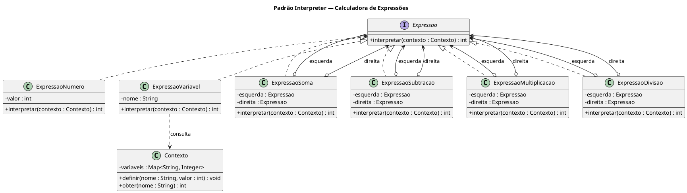

# Interpreter — Calculadora de Expressões Implementation Plan

> **For agentic workers:** REQUIRED SUB-SKILL: Use superpowers:subagent-driven-development (recommended) or superpowers:executing-plans to implement this plan task-by-task. Steps use checkbox (`- [ ]`) syntax for tracking.

**Goal:** Implementar o padrão GoF Interpreter como módulo Maven, modelando expressões aritméticas como árvores de objetos avaliadas via polimorfismo.

**Architecture:** A interface `Expressao` define `interpretar(Contexto)`. Expressões terminais (`ExpressaoNumero`, `ExpressaoVariavel`) são folhas da árvore. Expressões não-terminais (`ExpressaoSoma`, `ExpressaoSubtracao`, `ExpressaoMultiplicacao`, `ExpressaoDivisao`) compõem duas sub-expressões e delegam recursivamente. `Contexto` carrega variáveis nomeadas.

**Tech Stack:** Java 17, Maven 3, JUnit Jupiter 5.10.1

---

## Task 1: Registrar módulo interpreter no pom.xml raiz

**Files:**
- Modify: `pom.xml`

- [ ] **Step 1: Adicionar módulo após `<module>proxy</module>`**

```xml
        <module>interpreter</module>
```

- [ ] **Step 2: Commit**

```bash
git add pom.xml
git commit -m "build: registra módulo interpreter no pom raiz"
```

---

## Task 2: Estrutura do módulo, interface e Contexto

**Files:**
- Create: `interpreter/pom.xml`
- Create: `interpreter/src/main/java/com/padroes/interpreter/Expressao.java`
- Create: `interpreter/src/main/java/com/padroes/interpreter/Contexto.java`

- [ ] **Step 1: Criar interpreter/pom.xml**

```xml
<?xml version="1.0" encoding="UTF-8"?>
<project xmlns="http://maven.apache.org/POM/4.0.0"
         xmlns:xsi="http://www.w3.org/2001/XMLSchema-instance"
         xsi:schemaLocation="http://maven.apache.org/POM/4.0.0 http://maven.apache.org/xsd/maven-4.0.0.xsd">
    <modelVersion>4.0.0</modelVersion>

    <parent>
        <groupId>com.padroes</groupId>
        <artifactId>padroes-arquitetura</artifactId>
        <version>1.0.0</version>
    </parent>

    <artifactId>interpreter</artifactId>
    <name>Interpreter Pattern</name>

    <dependencies>
        <dependency>
            <groupId>org.junit.jupiter</groupId>
            <artifactId>junit-jupiter</artifactId>
            <scope>test</scope>
        </dependency>
    </dependencies>
</project>
```

- [ ] **Step 2: Criar Expressao.java**

```java
package com.padroes.interpreter;

public interface Expressao {
    int interpretar(Contexto contexto);
}
```

- [ ] **Step 3: Criar Contexto.java**

```java
package com.padroes.interpreter;

import java.util.HashMap;
import java.util.Map;

public class Contexto {
    private final Map<String, Integer> variaveis = new HashMap<>();

    public void definir(String nome, int valor) {
        variaveis.put(nome, valor);
    }

    public int obter(String nome) {
        if (!variaveis.containsKey(nome)) {
            throw new IllegalArgumentException("Variável não definida: " + nome);
        }
        return variaveis.get(nome);
    }
}
```

---

## Task 3: Expressões terminais

**Files:**
- Create: `interpreter/src/main/java/com/padroes/interpreter/ExpressaoNumero.java`
- Create: `interpreter/src/main/java/com/padroes/interpreter/ExpressaoVariavel.java`

- [ ] **Step 1: Criar ExpressaoNumero.java**

```java
package com.padroes.interpreter;

public class ExpressaoNumero implements Expressao {
    private final int valor;

    public ExpressaoNumero(int valor) {
        this.valor = valor;
    }

    @Override
    public int interpretar(Contexto contexto) {
        return valor;
    }
}
```

- [ ] **Step 2: Criar ExpressaoVariavel.java**

```java
package com.padroes.interpreter;

public class ExpressaoVariavel implements Expressao {
    private final String nome;

    public ExpressaoVariavel(String nome) {
        this.nome = nome;
    }

    @Override
    public int interpretar(Contexto contexto) {
        return contexto.obter(nome);
    }
}
```

---

## Task 4: Expressões não-terminais

**Files:**
- Create: `interpreter/src/main/java/com/padroes/interpreter/ExpressaoSoma.java`
- Create: `interpreter/src/main/java/com/padroes/interpreter/ExpressaoSubtracao.java`
- Create: `interpreter/src/main/java/com/padroes/interpreter/ExpressaoMultiplicacao.java`
- Create: `interpreter/src/main/java/com/padroes/interpreter/ExpressaoDivisao.java`

- [ ] **Step 1: Criar ExpressaoSoma.java**

```java
package com.padroes.interpreter;

public class ExpressaoSoma implements Expressao {
    private final Expressao esquerda;
    private final Expressao direita;

    public ExpressaoSoma(Expressao esquerda, Expressao direita) {
        this.esquerda = esquerda;
        this.direita = direita;
    }

    @Override
    public int interpretar(Contexto contexto) {
        return esquerda.interpretar(contexto) + direita.interpretar(contexto);
    }
}
```

- [ ] **Step 2: Criar ExpressaoSubtracao.java**

```java
package com.padroes.interpreter;

public class ExpressaoSubtracao implements Expressao {
    private final Expressao esquerda;
    private final Expressao direita;

    public ExpressaoSubtracao(Expressao esquerda, Expressao direita) {
        this.esquerda = esquerda;
        this.direita = direita;
    }

    @Override
    public int interpretar(Contexto contexto) {
        return esquerda.interpretar(contexto) - direita.interpretar(contexto);
    }
}
```

- [ ] **Step 3: Criar ExpressaoMultiplicacao.java**

```java
package com.padroes.interpreter;

public class ExpressaoMultiplicacao implements Expressao {
    private final Expressao esquerda;
    private final Expressao direita;

    public ExpressaoMultiplicacao(Expressao esquerda, Expressao direita) {
        this.esquerda = esquerda;
        this.direita = direita;
    }

    @Override
    public int interpretar(Contexto contexto) {
        return esquerda.interpretar(contexto) * direita.interpretar(contexto);
    }
}
```

- [ ] **Step 4: Criar ExpressaoDivisao.java**

```java
package com.padroes.interpreter;

public class ExpressaoDivisao implements Expressao {
    private final Expressao esquerda;
    private final Expressao direita;

    public ExpressaoDivisao(Expressao esquerda, Expressao direita) {
        this.esquerda = esquerda;
        this.direita = direita;
    }

    @Override
    public int interpretar(Contexto contexto) {
        return esquerda.interpretar(contexto) / direita.interpretar(contexto);
    }
}
```

---

## Task 5: Testes, Main, diagrama e commit

**Files:**
- Create: `interpreter/src/test/java/com/padroes/interpreter/InterpreterTest.java`
- Create: `interpreter/src/main/java/com/padroes/interpreter/Main.java`
- Create: `interpreter/diagram.puml`

- [ ] **Step 1: Criar InterpreterTest.java**

```java
package com.padroes.interpreter;

import org.junit.jupiter.api.BeforeEach;
import org.junit.jupiter.api.DisplayName;
import org.junit.jupiter.api.Nested;
import org.junit.jupiter.api.Test;

import static org.junit.jupiter.api.Assertions.*;

@DisplayName("Interpreter — Calculadora de Expressões")
class InterpreterTest {

    private Contexto ctx;

    @BeforeEach
    void setUp() {
        ctx = new Contexto();
    }

    @Nested
    @DisplayName("ExpressaoNumero")
    class ExpressaoNumeroTest {

        @Test
        @DisplayName("Deve retornar o literal inteiro")
        void deveRetornarLiteral() {
            assertEquals(42, new ExpressaoNumero(42).interpretar(ctx));
        }

        @Test
        @DisplayName("Deve retornar zero")
        void deveRetornarZero() {
            assertEquals(0, new ExpressaoNumero(0).interpretar(ctx));
        }

        @Test
        @DisplayName("Deve retornar valor negativo")
        void deveRetornarNegativo() {
            assertEquals(-5, new ExpressaoNumero(-5).interpretar(ctx));
        }
    }

    @Nested
    @DisplayName("ExpressaoVariavel")
    class ExpressaoVariavelTest {

        @Test
        @DisplayName("Deve retornar valor definido no contexto")
        void deveRetornarValorDoContexto() {
            ctx.definir("x", 7);
            assertEquals(7, new ExpressaoVariavel("x").interpretar(ctx));
        }

        @Test
        @DisplayName("Deve lançar exceção para variável não definida")
        void deveLancarExcecaoParaVariavelNaoDefinida() {
            assertThrows(IllegalArgumentException.class,
                () -> new ExpressaoVariavel("z").interpretar(ctx));
        }
    }

    @Nested
    @DisplayName("Operações básicas")
    class OperacoesBasicasTest {

        @Test
        @DisplayName("Soma: 3 + 4 = 7")
        void soma() {
            Expressao expr = new ExpressaoSoma(new ExpressaoNumero(3), new ExpressaoNumero(4));
            assertEquals(7, expr.interpretar(ctx));
        }

        @Test
        @DisplayName("Subtração: 10 - 3 = 7")
        void subtracao() {
            Expressao expr = new ExpressaoSubtracao(new ExpressaoNumero(10), new ExpressaoNumero(3));
            assertEquals(7, expr.interpretar(ctx));
        }

        @Test
        @DisplayName("Multiplicação: 6 * 7 = 42")
        void multiplicacao() {
            Expressao expr = new ExpressaoMultiplicacao(new ExpressaoNumero(6), new ExpressaoNumero(7));
            assertEquals(42, expr.interpretar(ctx));
        }

        @Test
        @DisplayName("Divisão: 20 / 4 = 5")
        void divisao() {
            Expressao expr = new ExpressaoDivisao(new ExpressaoNumero(20), new ExpressaoNumero(4));
            assertEquals(5, expr.interpretar(ctx));
        }
    }

    @Nested
    @DisplayName("Expressões compostas")
    class ExpressoesCompostasTest {

        @Test
        @DisplayName("(x + 3) * 2 - y com x=10, y=3 deve ser 23")
        void expressaoComVariaveis() {
            ctx.definir("x", 10);
            ctx.definir("y", 3);
            // (10 + 3) * 2 - 3 = 13 * 2 - 3 = 26 - 3 = 23
            Expressao expr = new ExpressaoSubtracao(
                new ExpressaoMultiplicacao(
                    new ExpressaoSoma(
                        new ExpressaoVariavel("x"),
                        new ExpressaoNumero(3)
                    ),
                    new ExpressaoNumero(2)
                ),
                new ExpressaoVariavel("y")
            );
            assertEquals(23, expr.interpretar(ctx));
        }

        @Test
        @DisplayName("100 / (5 * 4) deve ser 5")
        void divisaoComMultiplicacaoAninhada() {
            Expressao expr = new ExpressaoDivisao(
                new ExpressaoNumero(100),
                new ExpressaoMultiplicacao(
                    new ExpressaoNumero(5),
                    new ExpressaoNumero(4)
                )
            );
            assertEquals(5, expr.interpretar(ctx));
        }

        @Test
        @DisplayName("Mesma expressão com contextos diferentes produz resultados diferentes")
        void mesmaExpressaoContextosDiferentes() {
            Expressao expr = new ExpressaoSoma(
                new ExpressaoVariavel("a"),
                new ExpressaoVariavel("b")
            );

            ctx.definir("a", 1);
            ctx.definir("b", 2);
            assertEquals(3, expr.interpretar(ctx));

            Contexto ctx2 = new Contexto();
            ctx2.definir("a", 100);
            ctx2.definir("b", 200);
            assertEquals(300, expr.interpretar(ctx2));
        }

        @Test
        @DisplayName("((2 + 3) * (4 - 1)) / 5 deve ser 3")
        void expressaoProfundamenteAninhada() {
            // ((2 + 3) * (4 - 1)) / 5 = (5 * 3) / 5 = 15 / 5 = 3
            Expressao expr = new ExpressaoDivisao(
                new ExpressaoMultiplicacao(
                    new ExpressaoSoma(new ExpressaoNumero(2), new ExpressaoNumero(3)),
                    new ExpressaoSubtracao(new ExpressaoNumero(4), new ExpressaoNumero(1))
                ),
                new ExpressaoNumero(5)
            );
            assertEquals(3, expr.interpretar(ctx));
        }
    }
}
```

- [ ] **Step 2: Criar Main.java**

```java
package com.padroes.interpreter;

public class Main {
    public static void main(String[] args) {
        Contexto ctx = new Contexto();
        ctx.definir("x", 10);
        ctx.definir("y", 3);

        // (x + 3) * 2 - y = (10 + 3) * 2 - 3 = 23
        Expressao expr = new ExpressaoSubtracao(
            new ExpressaoMultiplicacao(
                new ExpressaoSoma(
                    new ExpressaoVariavel("x"),
                    new ExpressaoNumero(3)
                ),
                new ExpressaoNumero(2)
            ),
            new ExpressaoVariavel("y")
        );

        System.out.println("x = " + ctx.obter("x") + ", y = " + ctx.obter("y"));
        System.out.println("(x + 3) * 2 - y = " + expr.interpretar(ctx));

        // 100 / (5 * 4) = 5
        Expressao divisao = new ExpressaoDivisao(
            new ExpressaoNumero(100),
            new ExpressaoMultiplicacao(
                new ExpressaoNumero(5),
                new ExpressaoNumero(4)
            )
        );
        System.out.println("100 / (5 * 4) = " + divisao.interpretar(ctx));
    }
}
```

- [ ] **Step 3: Criar diagram.puml**



- [ ] **Step 4: Commit**

```bash
git add interpreter/
git commit -m "feat(interpreter): padrão Interpreter — calculadora de expressões aritméticas"
```
