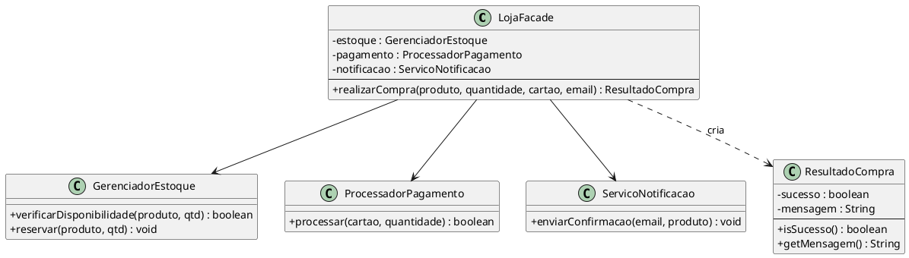

# Facade

```plantuml
@startuml Facade

skinparam classAttributeIconSize 0
skinparam monochrome false
skinparam shadowing false

class LojaFacade {
    - estoque : GerenciadorEstoque
    - pagamento : ProcessadorPagamento
    - notificacao : ServicoNotificacao
    --
    + realizarCompra(produto, quantidade, cartao, email) : ResultadoCompra
}

class GerenciadorEstoque {
    + verificarDisponibilidade(produto, qtd) : boolean
    + reservar(produto, qtd) : void
}

class ProcessadorPagamento {
    + processar(cartao, quantidade) : boolean
}

class ServicoNotificacao {
    + enviarConfirmacao(email, produto) : void
}

class ResultadoCompra {
    - sucesso : boolean
    - mensagem : String
    --
    + isSucesso() : boolean
    + getMensagem() : String
}

LojaFacade --> GerenciadorEstoque
LojaFacade --> ProcessadorPagamento
LojaFacade --> ServicoNotificacao
LojaFacade ..> ResultadoCompra : cria

@enduml
```
