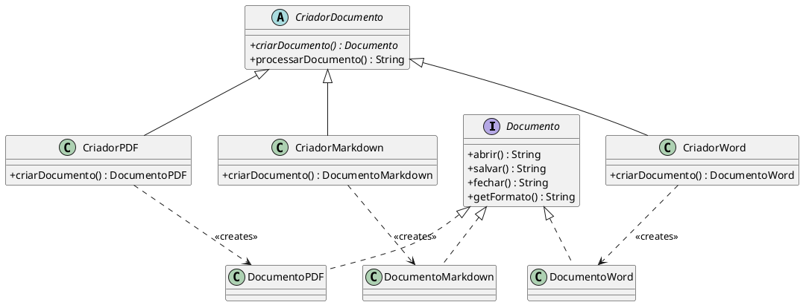

# Factory Method

```plantuml
@startuml FactoryMethod

skinparam classAttributeIconSize 0
skinparam monochrome false
skinparam shadowing false

interface Documento {
    + abrir() : String
    + salvar() : String
    + fechar() : String
    + getFormato() : String
}

class DocumentoPDF implements Documento
class DocumentoWord implements Documento
class DocumentoMarkdown implements Documento

abstract class CriadorDocumento {
    + {abstract} criarDocumento() : Documento
    + processarDocumento() : String
}

class CriadorPDF extends CriadorDocumento {
    + criarDocumento() : DocumentoPDF
}

class CriadorWord extends CriadorDocumento {
    + criarDocumento() : DocumentoWord
}

class CriadorMarkdown extends CriadorDocumento {
    + criarDocumento() : DocumentoMarkdown
}

CriadorPDF ..> DocumentoPDF : <<creates>>
CriadorWord ..> DocumentoWord : <<creates>>
CriadorMarkdown ..> DocumentoMarkdown : <<creates>>

@enduml
```
