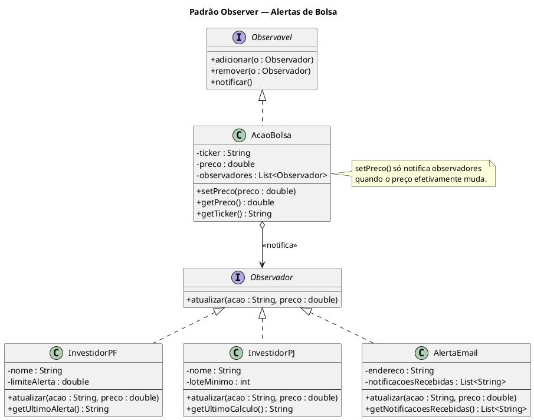

# Observer

```plantuml
@startuml Observer

skinparam classAttributeIconSize 0
skinparam monochrome false
skinparam shadowing false

title Padrão Observer — Alertas de Bolsa

interface Observador {
    + atualizar(acao : String, preco : double)
}

interface Observavel {
    + adicionar(o : Observador)
    + remover(o : Observador)
    + notificar()
}

class AcaoBolsa {
    - ticker : String
    - preco : double
    - observadores : List<Observador>
    --
    + setPreco(preco : double)
    + getPreco() : double
    + getTicker() : String
}

class InvestidorPF {
    - nome : String
    - limiteAlerta : double
    --
    + atualizar(acao : String, preco : double)
    + getUltimoAlerta() : String
}

class InvestidorPJ {
    - nome : String
    - loteMinimo : int
    --
    + atualizar(acao : String, preco : double)
    + getUltimoCalculo() : String
}

class AlertaEmail {
    - endereco : String
    - notificacoesRecebidas : List<String>
    --
    + atualizar(acao : String, preco : double)
    + getNotificacoesRecebidas() : List<String>
}

Observavel <|.. AcaoBolsa
Observador <|.. InvestidorPF
Observador <|.. InvestidorPJ
Observador <|.. AlertaEmail
AcaoBolsa o--> Observador : <<notifica>>

note right of AcaoBolsa
  setPreco() só notifica observadores
  quando o preço efetivamente muda.
end note

@enduml
```
