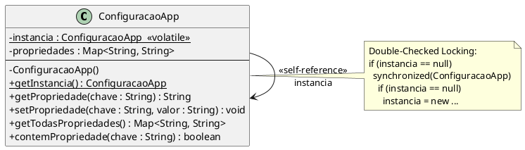

# Singleton

```plantuml
@startuml Singleton

skinparam classAttributeIconSize 0
skinparam monochrome false
skinparam shadowing false

class ConfiguracaoApp {
    - {static} instancia : ConfiguracaoApp  <<volatile>>
    - propriedades : Map<String, String>
    --
    - ConfiguracaoApp()
    + {static} getInstancia() : ConfiguracaoApp
    + getPropriedade(chave : String) : String
    + setPropriedade(chave : String, valor : String) : void
    + getTodasPropriedades() : Map<String, String>
    + contemPropriedade(chave : String) : boolean
}

note right of ConfiguracaoApp
  Double-Checked Locking:
  if (instancia == null)
    synchronized(ConfiguracaoApp)
      if (instancia == null)
        instancia = new ...
end note

ConfiguracaoApp --> ConfiguracaoApp : <<self-reference>>\ninstancia

@enduml
```
