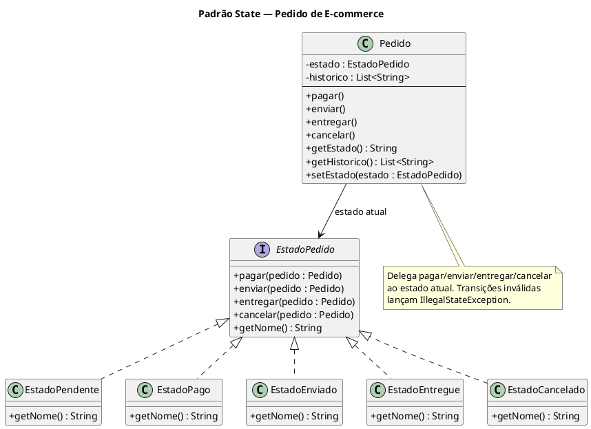
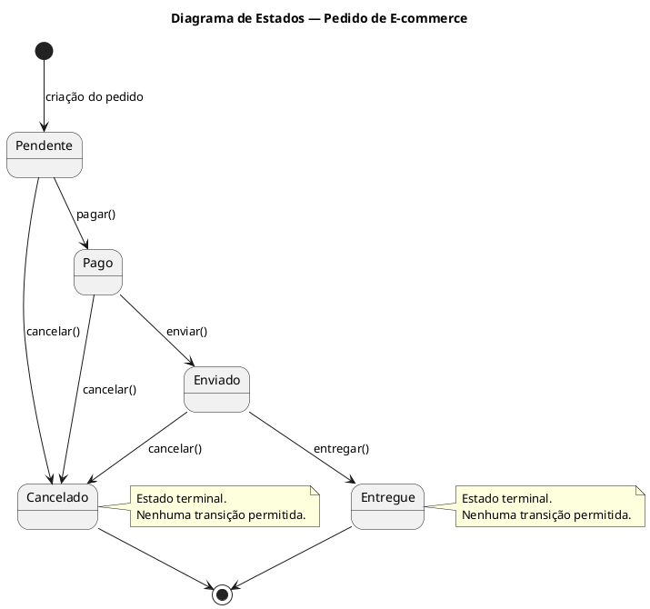

# State

## Diagrama de Classes

```plantuml
@startuml State

skinparam classAttributeIconSize 0
skinparam monochrome false
skinparam shadowing false

title Padrão State — Pedido de E-commerce

interface EstadoPedido {
    + pagar(pedido : Pedido)
    + enviar(pedido : Pedido)
    + entregar(pedido : Pedido)
    + cancelar(pedido : Pedido)
    + getNome() : String
}

class Pedido {
    - estado : EstadoPedido
    - historico : List<String>
    --
    + pagar()
    + enviar()
    + entregar()
    + cancelar()
    + getEstado() : String
    + getHistorico() : List<String>
    + setEstado(estado : EstadoPedido)
}

class EstadoPendente {
    + getNome() : String
}

class EstadoPago {
    + getNome() : String
}

class EstadoEnviado {
    + getNome() : String
}

class EstadoEntregue {
    + getNome() : String
}

class EstadoCancelado {
    + getNome() : String
}

Pedido --> EstadoPedido : estado atual
EstadoPedido <|.. EstadoPendente
EstadoPedido <|.. EstadoPago
EstadoPedido <|.. EstadoEnviado
EstadoPedido <|.. EstadoEntregue
EstadoPedido <|.. EstadoCancelado

note bottom of Pedido
  Delega pagar/enviar/entregar/cancelar
  ao estado atual. Transições inválidas
  lançam IllegalStateException.
end note

@enduml
```

## Diagrama de Estados

```plantuml
@startuml StateDiagram

skinparam monochrome false
skinparam shadowing false

title Diagrama de Estados — Pedido de E-commerce

[*] --> Pendente : criação do pedido

Pendente --> Pago      : pagar()
Pendente --> Cancelado : cancelar()

Pago --> Enviado   : enviar()
Pago --> Cancelado : cancelar()

Enviado --> Entregue  : entregar()
Enviado --> Cancelado : cancelar()

Entregue --> [*]
Cancelado --> [*]

note right of Entregue
  Estado terminal.
  Nenhuma transição permitida.
end note

note right of Cancelado
  Estado terminal.
  Nenhuma transição permitida.
end note

@enduml
```
